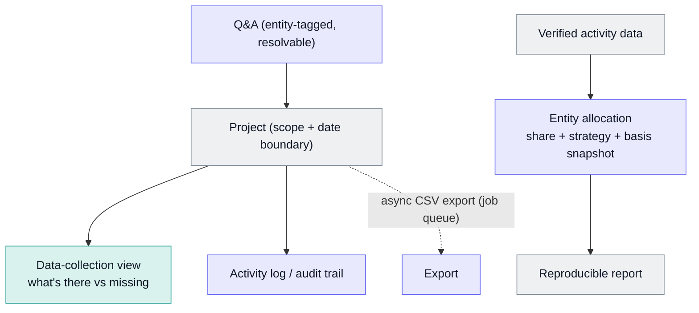

# Carbon Footprint Workspace

A project workspace where a producer gathers the activity data needed to calculate a product's carbon footprint.

Built at BX. What's shown here is the architecture and the design decisions.

Several engineers worked on the wider carbon footprint feature. I built the reworked project workspace end to end: the React UI and its backend (the data-collection Q&A, the activity log, the audit trail and the async export). I also built the allocation data model that keeps footprints reproducible. The underlying project model was built with colleagues, and I built on it.

## At a glance

| | |
|---|---|
| **What it is** | Lets a producer compile the activity data for a product's carbon footprint, scoped to chosen farms, crops and a time boundary, organised around projects. |
| **My role** | Built the reworked project workspace (UI and backend) and the allocation model underneath the footprint calculation. |
| **Stack** | Next.js / React (frontend), NestJS + Prisma + PostgreSQL (backend), pg-boss (a Postgres-backed job queue) for background jobs. |
| **Outcome** | Producers self-serve the data-collection workflow, the team chases gaps in-product, and the report stays reproducible as the underlying data changes. |

**Supporting files**

- [`example-allocation.json`](./example-allocation.json): synthetic allocation record.

## The problem

A product carbon footprint needs a lot of activity data (fuel, electricity, water, crop inputs, yield and more), scoped to particular farms, fields and crops over a time boundary. The final sum isn't the hard part. The hard parts are:

- showing a producer exactly what data is missing;
- chasing those gaps without endless email;
- apportioning shared activity data at the right level: a farm-wide fuel bill has to be split across the fields and crops it was actually used on;
- keeping a report **reproducible** while the underlying data keeps changing.

The rework rebuilt the whole experience around these.

## What it does

1. A producer opens a project (scope: farms, crops, date boundary).
2. A **data-collection** view shows, per farm and entity, what data exists and what's missing.
3. The team raises entity-tagged questions in a **Q&A** channel. The producer answers, or uploads data straight from a reply.
4. Shared activity records are **allocated** (apportioned) onto the fields and crops they relate to.
5. A reproducible **report** is produced, and an **activity** feed records everything that happened.

### The project workspace

On top of the shared project model, I built:

- the React UI: the data-collection view, the Q&A tab and the activity tab;
- entity-tagged, resolvable **Q&A** comments for chasing data gaps;
- a project **activity log** and an **audit trail** of every human action;
- customer-ownership checks on every endpoint;
- an **async CSV export** on a job queue, so large exports don't block or fail.

## Architecture

Indigo = my work · teal = the shared model I built on · grey = inputs/outputs.

## Data model

- **Project:** a scope (farms, crops) and a date boundary.
- **Activity record:** a piece of verified activity data, such as a fuel purchase.
- **Allocation:** links an activity record to a crop on a field, the level a footprint is built up from (see below).
- **Q&A comment:** tagged to an entity, and resolvable.
- **Audit entry:** one per human action; feeds the activity log.

### The allocation model

This is the piece I most own. The footprint calculation depends on apportioning shared activity records onto individual crops: one crop grown on one field in one season. Each allocation stores:

- a fractional **share** of the activity record;
- an **allocation strategy**: even, area-weighted, yield-weighted, time-overlap or manual;
- a **basis snapshot**: a frozen record of how the share was derived (the value, the total it was divided by, the unit).

The snapshot is the point. A report run last quarter still reproduces today, even though the underlying data has moved on. See [`example-allocation.json`](./example-allocation.json) for the shape.

## Rules & logic

- **Confidence** is derived on read, not stored.
- **The allocation universe** (the set of crops a record is shared across) is inferred from sibling allocations.
- **Deletes cascade** cleanly from activity records to their allocations.
- **Ownership:** every endpoint checks that the project belongs to the caller's customer account.

## Key decisions

| Decision | Why | Rejected alternative |
|---|---|---|
| **Allocation stores a basis snapshot** | Reports must reproduce even as data changes | Storing a single derived number: not reproducible or auditable |
| **Async export via a job queue** | Large exports shouldn't block the request or fail silently | Synchronous export: times out, fragile |
| **Audit-log every human action** | Powers the activity feed and gives accountability | No audit trail: no activity feed, no record of what happened |
| **Entity-tagged, resolvable Q&A** | Chase data gaps in-product, per entity, and track them | Email or spreadsheet chasing: unstructured and slow |
| **Check customer ownership on every endpoint** | A customer can only ever touch their own project data | Trusting the happy path: a security gap |

## Failure modes & lessons

- **Reproducibility was the subtle requirement.** The obvious design stores a computed footprint number. The right one stores the *basis* for each allocation, so the number can always be re-derived. Getting this wrong only surfaces months later, when an old report can't be reproduced.
- **Exports outgrow the request.** A synchronous CSV export is fine until it isn't. Moving it to a job queue with its own status fixed it.
- **Working inside someone else's model.** The allocation layer had to sit cleanly alongside the shared project structures rather than rewrite them: extend, don't replace.

## Rebuild spec

1. A project with a scope and a date boundary.
2. A data-collection view derived from what verified data exists.
3. An allocation model that stores share, strategy and a basis snapshot.
4. An entity-tagged, resolvable Q&A channel with upload-from-reply, plus an activity and audit log.
5. Async export on a job queue with a pollable status.
6. Customer-ownership checks on every endpoint.
