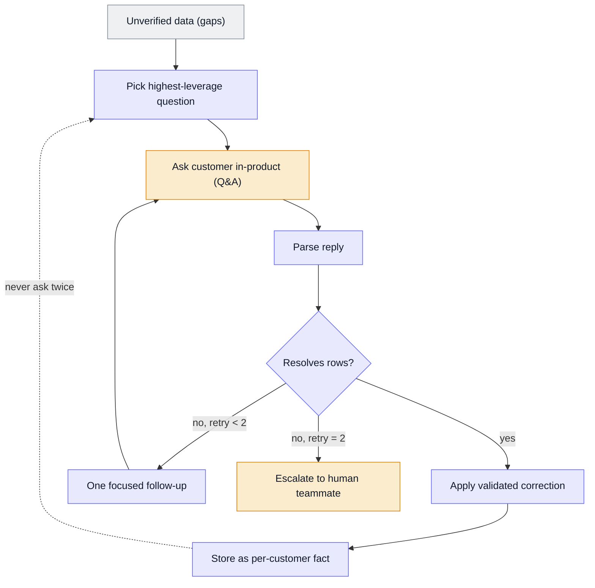

# Data Review Agent

An agent that finds gaps in ingested customer data, asks the customer in-product, and applies their answers.

Built at BX. What's shown here is the architecture and the design decisions.

This one is mine end to end: I designed and built it, from the problem definition through to production. It sits on top of the [unstructured-data-pipeline](../unstructured-data-pipeline) as its human-in-the-loop resolution layer.

## At a glance

| | |
|---|---|
| **What it is** | An agent that finds gaps in ingested customer data, asks the customer the right questions in-product and applies their answers, instead of the team chasing them by email. |
| **My role** | Designed and built it end to end, including the in-product Q&A surface it talks through. |
| **Stack** | An agent framework, LLMs and persistent per-customer memory, wired into the production data platform. |
| **Outcome** | In production. It removes a recurring manual task and scales as new customers onboard, without adding headcount. |

**Supporting files**

- [`example-interaction.md`](./example-interaction.md): synthetic end-to-end exchange.

## The problem

When a customer's document is missing something we require, or a value is ambiguous, the record can't be used until the gap is closed. Before this agent, closing it was manual: the customer-success team and I investigated and chased customers over email and spreadsheets. It was slow, it didn't scale, and it was the same handful of question types over and over.

I'd done that manual resolution myself, so I knew the problem first-hand. Once I saw the patterns in the gaps, I built an agent to do it.

## What it does

1. On a schedule, the agent scans unverified data for gaps.
2. It works out the **highest-leverage question**: the one answer that resolves the most rows at once, rather than asking row by row.
3. It posts that question to the customer **in-product**, through a Q&A surface I built for it.
4. When the customer answers, the agent decides whether that answer resolves rows. If it's inconclusive, it asks one focused follow-up.
5. After two unresolved attempts, it **escalates to a human** teammate rather than guessing.
6. It stores the answer as a **per-customer fact**, so the same question is never asked twice.

> Example: forty fuel rows are missing a fuel type. Rather than forty questions, the agent asks one:
> "Your March deliveries list 'gas oil'. Should these be recorded as red diesel?" One answer resolves
> all forty, and the mapping is remembered for next time.

## Architecture

## Data model

- **Gap:** an unresolved row in unverified data, grouped by the question that would resolve it.
- **Question / reply:** a Q&A thread with the customer, with a retry count.
- **Per-customer fact:** a resolved answer, stored in memory (see below).

### Memory

The agent keeps a per-customer store of resolved facts, such as a customer's own wording mapped to the standard term, or a standing clarification. This does two things:

- it stops the agent asking a question it already has the answer to;
- the system gets less intrusive for each customer over time, which keeps them willing to engage.

## Rules & logic

- **Question prioritisation:** choose the question that resolves the most outstanding rows, not one per row.
- **Resolution decision:** after each reply, resolve, follow up or escalate.
- **Escalation threshold:** two unresolved attempts, then a human. Never an indefinite loop, never a guess.
- **Memory write:** a validated answer becomes a stored per-customer fact.

## Key decisions

| Decision | Why | Rejected alternative |
|---|---|---|
| **Ask the highest-leverage question** | One good question can resolve dozens of rows and respects the customer's time | Row-by-row questioning: floods the customer, kills engagement |
| **Ask in-product, not by email** | Structured, trackable, and the customer is already in context | Email or spreadsheet chasing: unstructured, slow, untrackable |
| **Escalate to a human after two tries** | The customer, not the model, is the source of truth; some gaps need a person | Retrying forever, or imputing a plausible value: wrong data is worse than an open gap |
| **Persistent per-customer memory** | Never ask the same thing twice; less intrusive over time | A stateless agent: re-asks resolved questions, erodes trust |
| **Agent proposes, people decide** | Keeps a human in the loop exactly where judgement or missing facts need one | Fully autonomous resolution: unsafe for data people make decisions on |

## Failure modes & lessons

- **Ambiguous answers** are the main failure mode. The follow-up-then-escalate path contains them, and tuning when to stop retrying mattered more than tuning the questions.
- **Non-response:** some customers don't answer. The agent has to hand off gracefully, not stall the record.
- **Over-asking** was the original risk, and the reason prioritisation and memory exist.

The lesson that shaped the design: the hard part of "removing humans from the loop" isn't the automation. It's deciding exactly where a human still belongs.

## Rebuild spec

1. A scan over unverified data that groups gaps by the question that would resolve them.
2. A question-generation step that picks the highest-leverage question per customer.
3. An in-product Q&A surface to ask it and capture the reply.
4. A reply-parsing step and a resolve / follow-up / escalate decision, with a hard retry cap.
5. A per-customer memory of resolved facts, checked before any question is asked.
6. A clean escalation hand-off to a human for anything unresolved.
