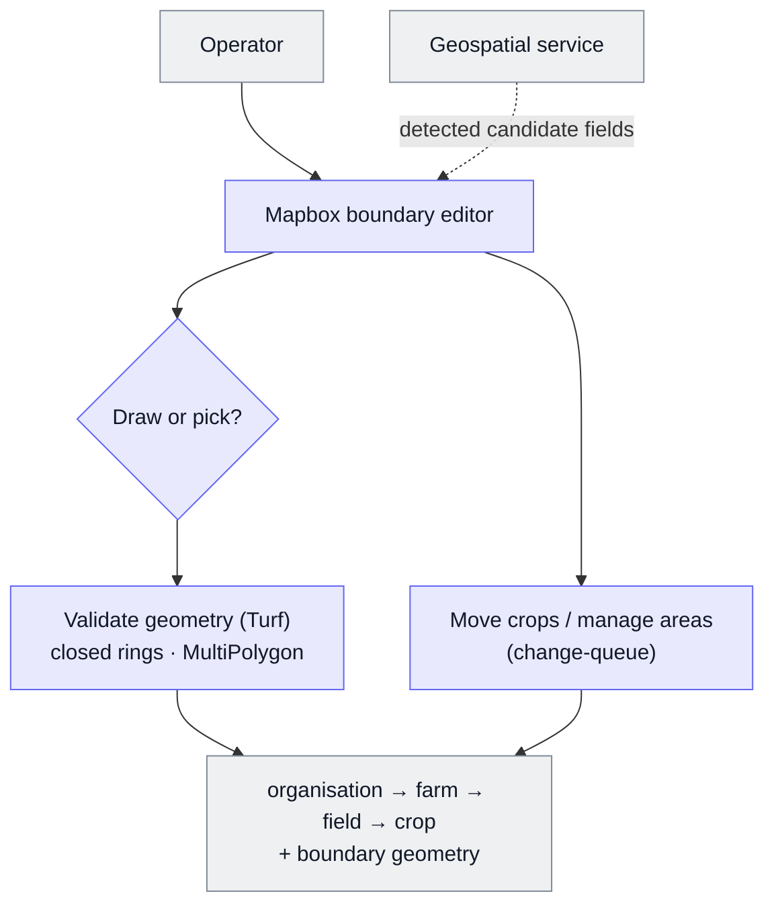

# Farm Admin Manager

Internal tooling for drawing and editing field boundaries on a map and keeping track of which crops are on which fields.

Built at BX. What's shown here is the architecture and the design decisions.

The admin tool is a team-built internal platform; the main contributors are colleagues and I'm one of several. I built the geospatial field-and-crop management: the Mapbox boundary editor and the tooling for moving crops between fields. I also contributed to some customer-management UI, but the customer onboarding and demo tooling is not mine to claim.

## At a glance

| | |
|---|---|
| **What it is** | Internal tooling that lets operators attach real-world field boundaries to the farm data hierarchy, and manage which crops are on which fields, without an engineer. |
| **My role** | Built the geospatial boundary editor and the tooling for moving crops between fields and managing their areas. |
| **Stack** | Kottster (a React/Vite admin framework), Mapbox GL + mapbox-gl-draw + Turf (a geospatial maths library) for editing and validation, Knex to the core PostgreSQL database. |
| **Outcome** | Operators attach and correct field boundaries, and reorganise crops across fields, self-serve. |

**Supporting files**

- [`example-field-boundary.geojson`](./example-field-boundary.geojson): synthetic validated boundary.

## The problem

Attaching accurate boundaries to fields, and keeping the organisation → farm → field → crop hierarchy correct (each crop on the right field, with the right area), was manual, engineer-led work. Real field geometry is awkward:

- a single "field" is often several disjoint parcels;
- boundaries come from different sources;
- one bad polygon breaks everything downstream.

It needed an operator tool that was **geospatially correct by construction**.

## What it does

- **Attach a boundary** by drawing it, or by **picking from detected fields** (candidate boundaries from a geospatial service) rather than drawing blind.
- **MultiPolygon support** (one shape made of several separate polygons, so a field can be several parcels), with **per-parcel select and delete**, a centre-on-field "locate" and configurable map labels.
- Build and maintain the **organisation → farm → field → crop** hierarchy.
- **Move crops** between fields and manage field and crop areas, with edits batched through a change-queue.
- **Validate geometry** (closed rings, coordinate and polygon checks via Turf) before it's saved.

## Architecture

## Data model

- The customer hierarchy: **Organisation → Farm → Field → Crop**. A *crop* here is one crop grown on a field (or part of one) in a given season, with its own area, so one field can hold several.
- **Boundary geometries** attached to fields and crops, as **Polygon or MultiPolygon**.

## Rules & logic

- Boundaries can be **drawn or picked** from detected candidates. Either way, the geometry is validated before saving.
- **MultiPolygon is first-class:** fields made of several parcels are selected, edited and deleted parcel by parcel.
- **Crop moves and area edits are batched** through a change-queue, so a set of edits applies cleanly rather than one write per click.

## Key decisions

| Decision | Why | Rejected alternative |
|---|---|---|
| **Pick from detected fields** | Operators start from real geometry instead of drawing blind | Hand-drawing every boundary: slow and inaccurate |
| **First-class MultiPolygon** | Real fields are often several disjoint parcels | Single polygon only: can't represent real fields |
| **Validate geometry at entry (Turf)** | Catch broken boundaries before they enter the data model | Accepting whatever's drawn: invalid geometry breaks things downstream |
| **Batch edits through a change-queue** | A set of reassignments or area edits applies cleanly and predictably | Direct per-action writes: stale state and partial updates (bugs I hit and fixed) |
| **Per-parcel select and delete** | Precise control over multi-parcel fields | All-or-nothing editing: too blunt for real geometry |

## Failure modes & lessons

- **Interactive map state is fiddly.** The real bugs were stale closures and state desync, where the UI and the underlying selection drift apart. Several of my fixes were exactly this.
- **Geometry correctness** (closing rings, handling MultiPolygon) is the quiet source of downstream breakage. Validating at entry contains it.
- This is the hands-on geospatial work I most want to build on and go deeper into.

## Rebuild spec

1. A map editor that pulls candidate boundaries from a geospatial service and lets an operator draw or pick.
2. First-class Polygon and MultiPolygon support, with per-parcel selection.
3. Geometry validation (closed rings, coordinate checks) at the point of entry.
4. The organisation → farm → field → crop hierarchy, with boundary geometries attached.
5. Moving crops between fields and managing areas, batched through a change-queue.
