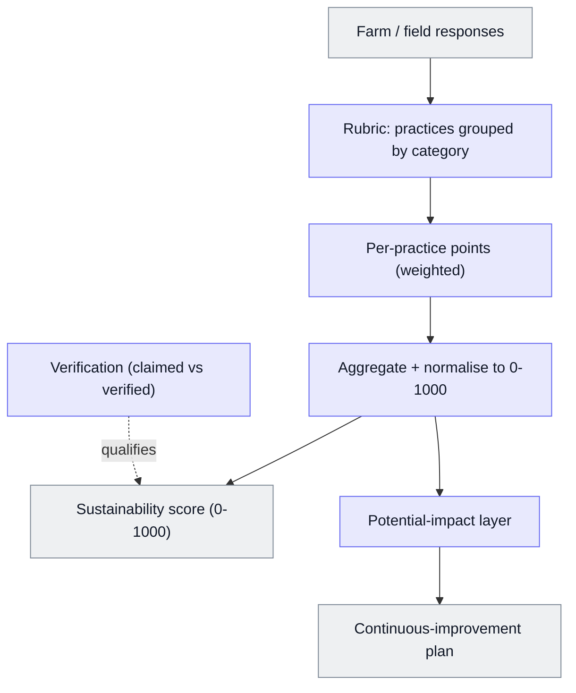

# Farm Sustainability Score

A crop-agnostic 0–1000 sustainability score for a farm, built by hand in a spreadsheet before AI coding tools.

Built at BX. What's shown here is the architecture and the design decisions.

The underlying scoring methodology was informed by a regenerative-agriculture consultancy. The calculator, the model that turns that methodology into a working, versioned, farm-by-farm score, is mine: I designed and built it on my own as the business's first scoring engine. It was later ported into the product.

This is the odd one out in the portfolio. I built it in 2023, before AI coding tools, with every formula written by hand. The decisions are the same kind as in the other projects; only the tooling differs.

## At a glance

| | |
|---|---|
| **What it is** | A crop-agnostic 0–1000 sustainability score for a farm, built from a rubric of science-backed regenerative and farm-management practices. |
| **My role** | Designed and built the original scoring model by hand in Google Sheets. It became the product's scoring and the basis of a continuous-improvement plan for farmers. |
| **Stack** | Google Sheets (formulas only: no code, no AI). Later ported into the product. |
| **Outcome** | Now the production scoring engine. |

**Supporting files**

- [`example-scoring.md`](./example-scoring.md): synthetic miniature of the method; made-up practices and points, not the real model.

## The problem

A rubric of practices tells you *what* good looks like, but not *how good a given farm is*. The job was to turn that qualitative rubric into a single, defensible, **comparable** number that:

- works across any crop;
- a farmer can act on;
- holds up when the methodology itself changes.

And it had to be built fast, by one person, before there was a product or an engineering team.

## What it does

1. A farm records which practices it follows, per field.
2. Each practice contributes points, weighted by its category.
3. The points aggregate and normalise to a single **0–1000 score** for the farm.
4. A **potential-impact** layer shows where the biggest gains are, so the score doubles as a continuous-improvement plan, not just a grade.
5. A **verification** dimension separates claimed practice from verified practice.

## Architecture

## Data model

- **Rubric:** practices grouped into categories; each category has a weight and each practice has points.
- **Responses:** which practices a farm follows, per field, each marked claimed or verified.
- **Model version:** the rubric is versioned, and historical responses can be re-scored on a newer version.

## Rules & logic

- **Normalisation to 0–1000** so scores are comparable across farms and crops, not raw point totals.
- **Category weighting** so the score reflects the relative importance of practice areas, not a flat count.
- **Crop-agnostic:** one model scores any farm, rather than a model per crop.
- **Verification:** the model distinguishes practices a farm claims from practices that are verified.
- **Potential impact:** the gap between current and achievable score becomes prioritised actions.

## Key decisions

| Decision | Why | Rejected alternative |
|---|---|---|
| **0–1000 normalised score** | Comparable across farms and crops, and intuitive | Raw point totals: not comparable between farms |
| **One crop-agnostic model** | A single, maintainable score anyone can be measured on | Per-crop models: fragmented, hard to maintain and compare |
| **Score doubles as an improvement plan** | A grade alone doesn't change behaviour; priorities do | Score only: tells a farmer where they are, not what to do next |
| **Versioned, with historical re-scoring** | When the methodology changed, old responses had to re-score on the new model so trends stayed honest | Leaving old scores on the old model: breaks comparability over time |
| **Build it in a spreadsheet first** | Fast to iterate, and transparent to the non-engineers who owned the methodology | Going straight to code: slower to change, opaque to the domain experts |

## Failure modes & lessons

- **Versioning was the hard part, and I underestimated it.** Changing the methodology meant migrating and re-scoring historical responses so a farm's trend line stayed meaningful. I built that old-to-new mapping and re-score by hand. Lesson: a score is only as trustworthy as its comparability over time, so plan for the model to change from day one.
- **A spreadsheet was the right start and the wrong end.** It let me iterate fast and keep the domain experts involved, but it didn't scale, which is why it was later ported into the product.
- **The judgement travelled; the tool didn't.** Moving from sheet to code (and later into AI-native building) changed how the logic was written, not the thinking behind it.

### From sheet to product

The spreadsheet was the business's first working score. Once proven, it was ported into the product as the scoring engine. It now underpins customers' scores and the improvement plans built on them.

## Rebuild spec

1. A rubric of practices grouped into weighted categories, with points per practice.
2. Per-field responses recording which practices a farm follows, marked claimed or verified.
3. Aggregation of weighted points, normalised to 0–1000.
4. A potential-impact step that ranks the biggest remaining gains as an improvement plan.
5. Versioning of the rubric, with a mapping to re-score historical responses on a new version.
