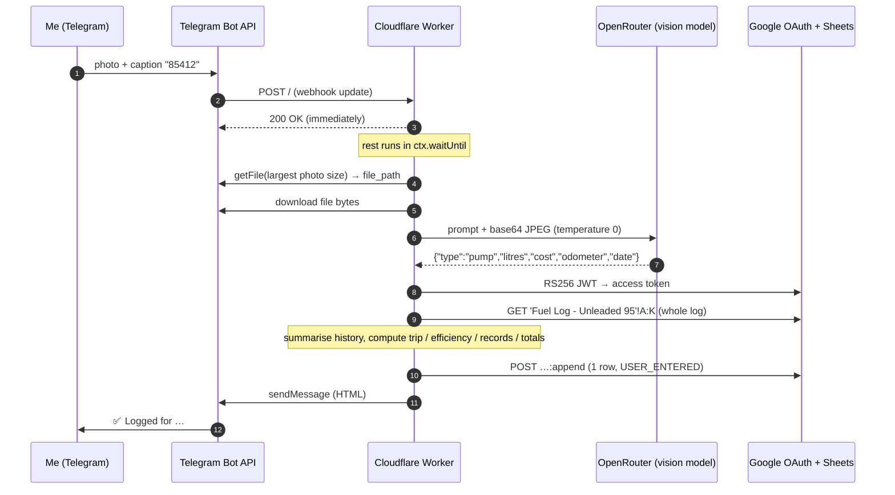

# Fuel Logging Bot

A Telegram bot that turns a photo of the fuel pump, captioned with the odometer reading, into a row in a Google Sheet and replies with the trip, efficiency and running totals.

## At a glance

| | |
|---|---|
| **What it is** | Telegram bot that turns a pump photo into a fuel-log row, plus a `stats` command. A vision model reads the litres and cost from the photo |
| **Who uses it** | Just me |
| **Stack** | One Cloudflare Worker file (plain JS, no dependencies, about 480 lines) · Telegram Bot API · OpenRouter (`google/gemini-3.5-flash`) · Google Sheets API v4 with a service-account JWT (a signed token that lets a server identity call Google without a user login), signed in WebCrypto |
| **Status** | In personal use since May 2026 |
| **Repo** | Private (holds real fuel data and deployment config). This folder is the spec. |

**Supporting files**

- [`examples.md`](./examples.md): more worked examples (back-dating, stats, an unreadable photo, errors) with the exact reply templates.
- [`sheet-schema.md`](./sheet-schema.md): the full column spec, read-back parsing rules and locale caveat.
- [`vision-prompt.md`](./vision-prompt.md): the exact model prompt and output contract.

## The problem

Keeping a fuel log by hand means typing four numbers on a forecourt and then working out price per
litre, miles since the last fill and efficiency. Most people give up after a few fills. The pump display
already shows the numbers, so the bot reads them from a photo and does the rest.

## What it does

1. At the pump, take a photo of the display and send it to the bot with the odometer reading as the
   caption, for example `85412`. A relative date also works: `85412 yesterday`.
2. The bot reads the litres and total cost from the photo and calculates everything else from the
   previous row in the sheet.
3. It appends one row and replies with the fill. A 🏆 or 💀 marks any figure that is a new best or worst
   compared with every earlier fill.

**Example.** Photo of a display showing `42.18 L` and `£58.62`, captioned `85412`. The previous fill was
at 85,031 miles, 17 days earlier.

```text
✅ Logged for Sat 12th Sep 2026

🚗 Odometer: 85,412 miles
⛽ Litres: 42.18 L 🏆
💰 Cost: £58.62 💀
📊 Price/L: £1.390 💀
🌿 Efficiency: 14.54 km/L 💀
🛣️ Trip: 381 miles (613 km)
⏱️ Gap: 17.0 days 🏆

━━━━━━━━━━━━━━━
📈 Running totals

🛣️ Total miles: 1,102
🌍 Total km: 1,773
💸 Total spent: £215.44
🌿 Avg efficiency: 11.33 km/L
📉 Avg cost/mile: £0.20
📉 Avg cost/km: £0.12
```

The row it appended:

| Date | Odo | Litres | Cost | £/L | Trip mi | Trip km | km/L | £/mile | £/km | Timestamp |
| --- | --- | --- | --- | --- | --- | --- | --- | --- | --- | --- |
| 2026-09-12 | 85412 | 42.18 | 58.62 | 1.390 | 381 | 613.16 | 14.54 | 0.15 | 0.10 | 2026-09-12T08:14:03.000Z |

The working:

- £/L = 58.62 ÷ 42.18 = **1.390**
- trip = 85412 − 85031 = **381 mi** = 381 × 1.60934 = **613.16 km**
- km/L = 613.16 ÷ 42.18 = **14.54**
- £/mile = 58.62 ÷ 381 = **0.15**
- £/km = 58.62 ÷ 613.16 = **0.10**

Send `stats` for a table of average, minimum and maximum for every metric. More examples, covering
back-dating, stats, an unreadable photo and errors, with the exact reply templates, are in
[`examples.md`](examples.md). The example data is fictional, but the output is real: it comes from
running the production Worker locally against mocked APIs.

## Architecture



| Part | Role |
| --- | --- |
| **Telegram bot** | The interface. Using the phone camera and a caption is quicker than any form. |
| **Cloudflare Worker** | The only compute. It replies `200` at once and does all the work in `ctx.waitUntil` (which keeps the Worker running after the response is sent). It keeps no state between requests. |
| **OpenRouter** | One OpenAI-compatible endpoint for the vision model. The model is a plain config var (`AI_MODEL`). |
| **Google Sheet** | The database and the source of truth. Each request re-reads the whole log to work out the previous fill, the records and the totals. |
| **Google OAuth** | A service-account JWT, signed with WebCrypto inside the Worker (no Google SDK), exchanged for a 1-hour access token. |

## Data model

The only store is one tab, `Fuel Log - Unleaded 95`, with columns A to K and a header in row 1. The full
column spec, the read-back parsing rules and the locale caveat are in
[`sheet-schema.md`](sheet-schema.md).

| Col | Field | Source |
| --- | --- | --- |
| A | date `YYYY-MM-DD` | model (caption) or message date (UTC) |
| B | odometer, miles | model (caption) |
| C | litres | model (photo) |
| D | cost £ | model (photo) |
| E | price per litre, 3 dp | D ÷ C |
| F | trip miles | B − previous B |
| G | trip km, 2 dp | F × 1.60934 |
| H | km/L, 2 dp | G ÷ C |
| I | £/mile, 2 dp | D ÷ F |
| J | £/km, 2 dp | D ÷ G |
| K | fill timestamp, ISO UTC | message time, or midday if back-dated |

The Worker computes every value. The sheet holds plain values, not formulas.

Model output contract: see [`vision-prompt.md`](vision-prompt.md).

## Rules & logic

### Webhook routing

1. Any method other than `POST`: return `200 "OK"`. This doubles as the health check.
2. Parse the body as JSON and set `message = body.message || body.edited_message`. If there is neither,
   return `200`.
3. If there is **no photo** and `text.trim().toLowerCase()` is `stats` or `/stats`, run `sendStats` in
   `waitUntil` and return `200`.
4. If there is **no photo**, return `200` and stay silent.
5. Otherwise use `fileId = photo[photo.length − 1].file_id` (Telegram lists sizes smallest first, so this
   is the largest), with `caption = (caption || "").trim()` and `unixDate = message.date`. Run
   `processFuelLog` in `waitUntil` and return `200`.
6. If anything throws synchronously, such as bad JSON, log it and return `500`. Telegram will retry the
   update.

### Fill pipeline (`processFuelLog`)

1. `dateStr` is the message date as an ISO date in **UTC**.
2. Fetch the photo with `getFile`, then download it from `/file/bot<token>/<file_path>`. Convert the
   bytes to base64 in **32 KB chunks**, because a single `String.fromCharCode(...bytes)` overflows the
   call stack above about 128 KB.
3. Call the model with the prompt in [`vision-prompt.md`](vision-prompt.md).
4. If the result is `type === "unknown"`, reply with the "couldn't read" message and stop. Nothing is
   written.
5. Set:
   - `finalDate = ai.date || dateStr`
   - `litres = parseFloat`
   - `cost = parseFloat`
   - `odometer = parseInt`
   - `pricePerLitre = (cost / litres).toFixed(3)`
6. **Fill time.** If `ai.date` is set and differs from `dateStr`, the fill is back-dated and its time is
   `${finalDate}T12:00:00Z`. Otherwise it is the message time. This goes in column K.
7. Read the whole range A:K and drop row 1. Run `summariseHistory` over the remaining rows (next
   section).
8. Calculate the current fill:
   - `prevOdometer = history.lastOdometer || odometer`, so the first ever fill has a trip of 0
   - `milesDriven = odometer − prevOdometer`
   - `kmDriven = milesDriven × 1.60934`
   - `kmPerLitre = kmDriven / litres` if both are > 0, otherwise 0
   - `costPerMile = cost / milesDriven` if > 0, otherwise 0
   - `costPerKm = cost / kmDriven` if > 0, otherwise 0
   - `daysSinceLast = (fillTimeMs − lastFillMs) / 86 400 000`
   - show the Gap line only if the last fill time is known **and** `daysSinceLast > 0`
9. Work out the **record emojis** against the history *before* this fill (see below).
10. Running totals are the history totals plus this fill (miles, km, cost, litres).
11. Append one row:
    `[finalDate, odometer, litres, cost, pricePerLitre, milesDriven, km.toFixed(2), kmPerLitre.toFixed(2), costPerMile.toFixed(2), costPerKm.toFixed(2), fillTimestampISO]`
    using `valueInputOption=USER_ENTERED`.
12. Format the date for display as `Sat 12th Sep 2026` (11th, 12th and 13th take `th`) and send the
    reply. Any exception in steps 2 to 12 replies `❌ Error processing fuel log: <escaped message>`.

### History summary (`summariseHistory`)

This is a single pass, shared by the fill reply and `stats`, so a record shown in one always agrees with
the other.

- Each metric (litres, cost, price, trip, efficiency, £/mile, £/km, gap) tracks `{min, max, sum, count}`.
- **Only values > 0 count.** Blank or zero cells, such as the first fill's trip, are skipped.
- **Totals** (`totalLitres`, `totalSpent`, `totalMiles` from F, `totalKm` from G) add *every* row,
  including zeros.
- **Gap** is the difference in fill times between consecutive rows that have a parseable time, in days.
  The fill time comes from column K, or from column A at midnight if K is empty (see `sheet-schema.md`).
- Also kept:
  - `fills = rows.length`
  - `firstFillMs`
  - `lastFillMs`
  - `lastOdometer`, from column B of the last row with non-numeric characters stripped

### Record emojis

```text
emoji(val, min, max, invert):
  if no history for this metric (min = ∞) or val ≤ 0  → ""
  normal:  val ≥ max → " 🏆"   else val ≤ min → " 💀"
  invert:  val ≤ min → " 🏆"   else val ≥ max → " 💀"
```

| Metric | Direction | Rationale |
| --- | --- | --- |
| Litres | normal (biggest fill = 🏆) | Playful: a "record fill" |
| Cost | invert (cheapest = 🏆) | Spending less is good |
| Price/L | invert (cheapest = 🏆) | |
| Efficiency km/L | normal | |
| Trip miles | normal | Longest range on one tank |
| Gap days | normal | Longest between refuels |

Ties count, because the comparisons are `≥` and `≤`. With only one earlier value, min equals max, so the
first branch wins.

### Stats (`sendStats`)

- **avg is the mean of the per-fill values**, not a lifetime ratio, so it always falls between min and
  max.
- Lifetime weighted averages appear only in the shared Running totals block underneath.
- Layout rules are in `examples.md`.

### Validation and sanity checks

The Worker has none. Here is what it actually does, so a rebuild matches it:

- It does not check field types, ranges, or the odometer against the previous reading. A misread or
  typo is written as-is: a negative trip, `NaN` price per litre, or a blank cell where the model
  returned `null`. The reply shows the bad value, which is how errors get noticed, and the fix is to edit
  the sheet by hand.
- Its only guards are the model's `unknown` escape hatch and the `> 0` filters on records and the ratios.

### Idempotency and dedupe

The Worker has none. The design relies on two things:

- **Ack first.** The webhook returns `200` before doing any slow work, so Telegram's retry-on-failure
  almost never fires for a real fill.
- **The reply is the receipt.** Every write is confirmed in the chat. A duplicate is visible at once and
  can be deleted in the sheet.

Known ways to get duplicates:

- Sending the same photo twice.
- **Editing the caption** of a logged photo. Telegram sends an `edited_message` with the photo still
  attached, and it is processed as a new fill.

### Time zones

- Dates come from the message time in **UTC**. For a UK user on BST, a fill between 00:00 and 01:00
  local time is dated the previous day.
- The Workers runtime runs in UTC, so the day-of-week and ordinal formatting is consistent.

### Exact details (settled by the rebuild test)

A fresh agent rebuilt this bot from this folder alone and matched all 48 checks. These are the points it
had to guess at, with the answer from the original code:

- **Price/L badge** compares the *3 dp* value (`parseFloat(pricePerLitre)`), so ties at 3 dp count.
  Litres, cost, trip, efficiency and gap compare unrounded values.
- **Badge guard:** no badge if the history has no values for that field, or the current value is `<= 0`.
- **`lastFillMs`** is the time of the *literal last data row* (`NaN` if that row has no parseable time),
  not the last row that has a time. Gaps between fills compare each timed row with the previous timed row,
  skipping untimed rows.
- **Rounding** is plain JS `toFixed` everywhere, float quirks included (`15.255 → "15.25"`). Numbers use
  `toLocaleString()` with the runtime default locale (en-US on Workers).
- **Stats message raw HTML:** `📊 <b>All-time stats</b>\n{n} fills · {from} – {to}\n\n<pre>{escaped table}</pre>\n{totals block}`.
- **Unhandled errors:** a failed `getFile`, a failed file download or a token response with no
  `access_token` are not checked. The resulting exception goes to the generic error reply. An uncaught
  error returns `new Response("Error", { status: 500 })`.
- **PEM cleanup** regex: `/-----BEGIN[A-Z\s]+PRIVATE KEY-----/i`, then the END line, then literal `\n`, then whitespace.
- **The trailing space in the prompt (`Extract: `) is part of the exact text.** A byte-exact test will catch it.

## Key decisions

| Decision | Why | Rejected alternative |
|---|---|---|
| A Telegram photo with the odometer in the caption as the whole UI | Taking a photo is the quickest thing to do at a pump. The caption saves a second photo of the dashboard | A web form or app, which is too slow on a forecourt; a dashboard OCR photo, which is a second photo and harder to read |
| **The model parses the caption too** (odometer plus relative dates) | "yesterday" or "85,412 miles" just work, with no date-parsing code | Regex plus a date library, which is more code, and the date wording I'd actually type varies |
| One Worker, plain `fetch`, no dependencies | Fits the free tier, has no cold start and nothing to patch. The whole system is one file | Node server or Apps Script. Apps Script would make Sheets auth trivial, but webhooks and vision calls are clunkier there |
| **Return 200 at once and do the work in `ctx.waitUntil`** | Vision and Sheets calls take seconds, and a slow webhook makes Telegram retry and double-log | Processing synchronously, which risks retries and duplicate rows |
| OpenRouter with the model as a config var | Swap or upgrade the vision model by changing one string in `wrangler.jsonc` | Calling one provider's SDK directly, which locks you in |
| **Hand-rolled service-account JWT in WebCrypto** | The Google SDK assumes Node. Workers have `crypto.subtle` with RS256 built in, and it is about 40 lines | `googleapis` npm (too heavy, Node APIs); OAuth user consent (needs refresh-token storage) |
| **The Google Sheet as the database** | Readable and editable by hand, easy to chart, and mistakes can be fixed in the sheet | D1 or KV (Cloudflare's SQL database and key-value store), which would need a UI just to fix a typo |
| **Stateless: re-read the whole log every time** | The sheet is the single source of truth, so hand edits flow straight into the next trip, records and totals. A few hundred rows is trivial to read | Caching totals in KV, which drifts from the sheet after any manual edit |
| The Worker computes derived columns and writes values | The reply and the row are produced from the same numbers, so they can't disagree | Sheet formulas, which would need a round-trip to show them in the reply and break on manual row inserts |
| HTML `parse_mode`, escaping all dynamic text | Legacy Markdown has no `**`, so the bold never rendered. MarkdownV2 needs `. - ( )` escaped, and these messages are full of them | MarkdownV2 |
| A timestamp column (K), with back-dated fills set to **midday** | Needed for the refuel gap to one decimal place. Midday is the least-wrong guess when the real time is unknown | Using the message time for a back-dated fill, which is plainly wrong |
| Stats avg is the **mean of per-fill values** | The ratio form was tried first, and one fill with a missing cost put the "average" price below the minimum | Lifetime ratios in the table (still shown, but separately) |
| **One shared `runningTotalsBlock`** for the fill reply and stats | Identical by construction, not kept in step by hand | Two copies of the footer, which had already drifted |
| One `summariseHistory` pass shared by both commands | The rules about which rows count live in one place | Duplicating the scan |
| Miles odometer, km/L efficiency, £ | Matches the car's odometer (miles) and the metric I want to track | |

## Failure modes & lessons

| What happened | Fix / lesson |
| --- | --- |
| **The dashboard drifted ahead of git.** The live Worker reached version 13 through dashboard edits (trip, km, efficiency, records, 10 columns) while the repo still had the first version. | Pulled the live source into git and added Wrangler config matched to the deployed `compatibility_date`. The repo is now the source of truth and deploys go through `wrangler deploy`. |
| **Larger photos failed** with `RangeError: Maximum call stack size exceeded`. `btoa(String.fromCharCode(...bytes))` breaks above about 128 KB, which covers most pump photos. | Chunked base64 (32 KB slices). Checked byte-identical against a reference encoder from 1 KB to 4 MB, and the JWT signing reuses it. |
| **Bold never rendered.** Legacy Markdown has no `**`. | Switched to HTML. Because a stray `<` now kills the whole message, model reasons and API error bodies are escaped, so error replies always arrive. |
| **The stats average fell below the minimum.** The totals included rows that min and max skip. | The average is now the mean of the same per-fill population. Lifetime ratios moved below the table. |
| **The refuel gap was whole days only.** The sheet stored dates, not times. | Added column K. Old rows fall back to column A, so mixed history still works. |
| **The two totals footers diverged.** | Extracted one shared block, checked byte-identical. |

## Rebuild spec

### Accounts and integrations

| Service | Needed for | Setup |
| --- | --- | --- |
| Telegram | Bot | @BotFather → `/newbot` → token |
| OpenRouter | Vision model | API key with credit. Any vision-capable model id works; the original uses `google/gemini-3.5-flash` |
| Google Cloud | Sheets write | Project → enable **Google Sheets API** → create a service account → download the JSON key |
| Google Sheets | Storage | Create a sheet with a tab named exactly `Fuel Log - Unleaded 95` and a header in row 1. **Share it with the service account's `client_email` as an Editor**, or every call returns 403. Format column A as `yyyy-mm-dd` |
| Cloudflare | Hosting | Workers (the free plan is enough), Wrangler 4 |

### Config

| Name | Kind | Meaning |
| --- | --- | --- |
| `TELEGRAM_TOKEN` | secret | Bot token |
| `OPENROUTER_API_KEY` | secret | OpenRouter key |
| `SHEET_ID` | secret | Spreadsheet id from the URL |
| `GCP_CLIENT_EMAIL` | secret | `client_email` from the key JSON |
| `GCP_PRIVATE_KEY` | secret | `private_key` from the key JSON: the full PEM, either with literal `\n` escapes or real newlines (both are handled) |
| `AI_MODEL` | plain var in `wrangler.jsonc` | OpenRouter model id |

Code constants:

- `SHEET_TAB = "Fuel Log - Unleaded 95"` and range `A:K`
- km per mile `1.60934`
- currency `£`

The Wrangler config needs:

- `name: "fuel-bot"`
- `main: "worker.js"`
- `compatibility_date: "2026-05-06"`
- `vars.AI_MODEL`

The npm scripts are `dev` (`wrangler dev`), `deploy`, `tail` and `check` (`wrangler deploy --dry-run`).
Local secrets go in `.dev.vars`, which is gitignored.

### Google service-account auth in Workers (WebCrypto RS256)

Each run mints a new token (there is no cache). One token covers both the read and the append in a fill.

1. Build the header `{"alg":"RS256","typ":"JWT"}`.
2. Build the claims:
   - `iss = GCP_CLIENT_EMAIL`
   - `scope = "https://www.googleapis.com/auth/spreadsheets"`
   - `aud = "https://oauth2.googleapis.com/token"`
   - `iat = now`
   - `exp = now + 3600` (in seconds)
3. Base64-encode the JSON of each and strip the `=` padding. The original uses plain `btoa`. A rebuild
   should use **base64url** (`+`→`-`, `/`→`_`) for all three segments, which is correct whatever the
   claims contain.
4. Clean the PEM:
   - remove the `-----BEGIN … PRIVATE KEY-----` and `-----END … PRIVATE KEY-----` lines
   - remove literal `\n` sequences
   - remove all whitespace
   - `atob` the result into a `Uint8Array`
5. `crypto.subtle.importKey("pkcs8", bytes, {name:"RSASSA-PKCS1-v1_5", hash:"SHA-256"}, false, ["sign"])`
6. `crypto.subtle.sign("RSASSA-PKCS1-v1_5", key, utf8("<header>.<claims>"))`, then base64url the
   signature with no padding.
7. `POST https://oauth2.googleapis.com/token` with
   `Content-Type: application/x-www-form-urlencoded` and the body
   `grant_type=urn:ietf:params:oauth:grant-type:jwt-bearer&assertion=<jwt>`. Take `access_token` from
   the response.
8. Make the Sheets calls with `Authorization: Bearer <token>`:
   - `GET https://sheets.googleapis.com/v4/spreadsheets/{SHEET_ID}/values/{urlencode("Fuel Log - Unleaded 95!A:K")}`
   - `POST …/values/{same}:append?valueInputOption=USER_ENTERED` with the body `{"values":[[…11 cells…]]}`
   - A non-OK response from either throws `Sheets GET/POST Error: <body text>`

### Telegram calls

| Call | Use |
| --- | --- |
| `GET https://api.telegram.org/bot{token}/getFile?file_id={id}` | Returns `result.file_path` |
| `GET https://api.telegram.org/file/bot{token}/{file_path}` | Image bytes |
| `POST https://api.telegram.org/bot{token}/sendMessage` | Body `{chat_id, text, parse_mode:"HTML"}` |
| `GET https://api.telegram.org/bot{token}/setWebhook?url=<worker url>` | One-time setup. Check it with `getWebhookInfo` |

### Build plan

1. Scaffold: `package.json` (`"type":"module"`, with `wrangler` as a dev dependency), `wrangler.jsonc`,
   `.gitignore` (`node_modules`, `.wrangler`, `.dev.vars`), `.dev.vars.example` listing the five secret
   names.
2. Write the `fetch` handler with the webhook routing exactly as in *Rules & logic*. Reply `200`
   immediately and put the work in `ctx.waitUntil`.
3. Helpers:
   - `escapeHtml` (`&`, `<`, `>`)
   - chunked `bytesToBase64` (0x8000-byte slices)
   - `sendTelegram`
   - `getTelegramPhoto`
4. `getAiExtraction`: the exact prompt and request in [`vision-prompt.md`](vision-prompt.md), with
   fence-stripping and `JSON.parse`.
5. `getGoogleAuthToken`, following the JWT steps above.
6. `readFuelRows`, which returns the token and the data rows without the header, and `parseSheetNum` /
   `rowTimeMs` from [`sheet-schema.md`](sheet-schema.md).
7. `summariseHistory`: the single pass, the `> 0` rule for min, max and mean, totals over every row, and
   gaps between consecutive timed rows.
8. `processFuelLog`: steps 1 to 12 above, including back-dating to midday, the emojis, the append and the
   reply template from [`examples.md`](examples.md).
9. `runningTotalsBlock`, shared, and `sendStats`, with the `<pre>` table layout from `examples.md`.
10. Test locally with `npm run dev` by POSTing a fake update to `localhost:8787`. Check that an empty sheet
    (first fill, trip 0, no Gap line), a back-dated caption, `stats` on an empty log, and a photo over
    128 KB all behave as in `examples.md`.
11. Deploy: `wrangler secret put` for each of the five secrets, `npm run deploy`, then `setWebhook` to the
    Worker URL.

**Acceptance test.** With the three fictional earlier rows in `sheet-schema.md`, a fill sent at
`2026-09-12T08:14:03Z` with caption `85412`, where the model returns litres `42.18` and cost `58.62`,
must append exactly the row shown above and send exactly the reply in `examples.md` §1.

### Optional hardening (not in the original, so leave out for a like-for-like rebuild)

- Check Telegram's `X-Telegram-Bot-Api-Secret-Token` header, and keep an allowlist of `chat.id`s.
  Today, anyone who finds the bot's username can write rows.
- Dedupe on `photo.file_unique_id`, or on chat id plus message id, stored in KV or in a hidden column.
  Ignore `edited_message` for photos.
- Validate the model output: numeric, 1–150 L, a price per litre in a plausible band, and an odometer
  higher than the last reading. Ask for confirmation otherwise.
- Cache the Google access token for about 55 minutes.

## Known limits

- One user, one vehicle and one fuel type (the tab name hard-codes it). There is no multi-car support.
- **No auth on the webhook or chat**, no dedupe and no validation (see above).
- No caption means no reliable odometer. There is no guard, and the result depends on the model.
- An image sent as a file (`document`) rather than a photo is silently ignored.
- Dates are in UTC (see Time zones).
- The weighted running averages count the first ever fill's litres and cost, but its trip is 0. That
  pulls the lifetime km/L and £/mile slightly off the per-fill figures. The difference is expected and
  documented, not fixed.
- The log has to stay in fill order, because the previous fill is simply the last row.
- No partial fills or tank-to-tank logic. Every fill is assumed to cover the miles since the previous
  row.
