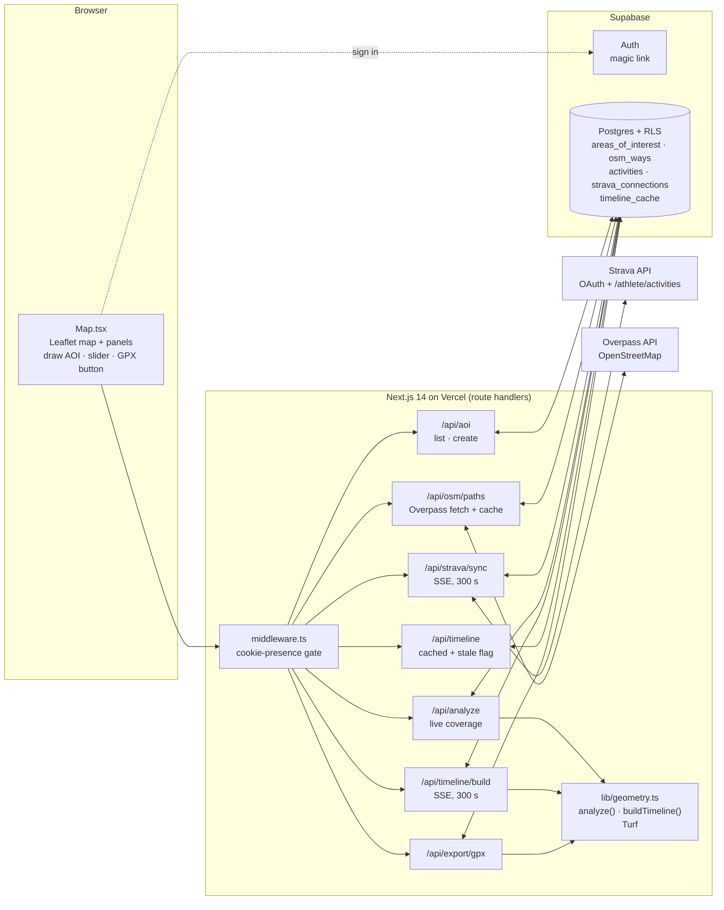

# Personal Map Coverage

A web map where you draw an area and see which of its paths your Strava activities have covered, what percentage that is, and how coverage grew over time.

## At a glance

| | |
|---|---|
| **What it is** | A web map. You outline an area (a common, a park, some woods) and cut out zones to ignore. It loads every footpath, track and bridleway from OpenStreetMap, then matches them against your GPS history. |
| **Who uses it** | Personal tool, multi-user by design: each person signs in and connects their own Strava account; the areas are shared. |
| **Stack** | Next.js 14 (App Router, route handlers) · TypeScript · Supabase (Postgres, magic-link auth, RLS row-level security) · Leaflet · Turf.js 7 (geospatial maths) · Strava API · OpenStreetMap Overpass API · Vercel |
| **Status** | Built in April 2026 as a rewrite of an earlier single-user Python/Flask version. |
| **Repo** | Private (contains the real areas and personal activity data). This folder is the spec. |

**Supporting files**

- [`coverage-algorithm.md`](./coverage-algorithm.md): the coverage algorithm, line by line.
- [`schema.sql`](./schema.sql): full database DDL with comments.
- [`examples/`](./examples): sample payloads (analysis response, timeline cache, missed-paths GPX, sync progress events).

## The problem

Strava shows where you have been. It cannot answer "how much of my local common have I actually explored, and which paths
have I never been down?" That needs a fixed list of every path in the area, a rule for when a path counts as done, and a way
to replay your history against that list. Off-the-shelf "explorer" tools work on map tiles or street grids. They don't use the
real path network of one specific area, and they can't leave out places you shouldn't go.

## What it does

1. **Sign in** with an email magic link (Supabase Auth).
2. **Connect Strava** (OAuth, `activity:read_all`). **Sync activities**: a progress bar streams (via SSE, server-sent events) while it pulls your runs, walks,
   hikes and rides. Later syncs only fetch what is new.
3. **Pick or draw an area (AOI, "area of interest").** Click points to draw the *inclusion* boundary, then optionally draw one or more *exclusion*
   zones (a lake, a golf course, a private enclosure), name it and save. AOIs are shared with every user of the app.
4. **Paths load automatically.** The first time an AOI is opened, the server asks Overpass (OpenStreetMap's public query API) for every walkable path way in its
   bounding box and caches them.
5. **See coverage.** Green = covered, red = unexplored, blue dashed = boundary, amber dashed = exclusions. A stats card shows
   `% paths covered` (green ≥ 80, amber ≥ 50, red below), covered and unexplored counts, and *visits to area*.
6. **Build the timeline.** This replays your history day by day. A slider and a ▶ button animate the map from your first
   visit to today (80 ms per activity day). The caption reads "*N activities · X % covered*" for the selected date.
7. **Click a path** to see its name (or type), how many times you have been on it, and the date it first counted as covered.
8. **↓ GPX** downloads every unexplored segment as a GPX track to load onto a watch and plan the next outing.

### Worked example: one AOI, end to end

*(Fictional area "Example Common". Figures are illustrative but follow the real rules exactly.)*

| Step | Result |
|---|---|
| Overpass returns ways in the AOI's bounding box | 268 ways |
| …with at least 2 consecutive vertices inside the inclusion polygon | 214 |
| …minus ways whose inside vertices all fall in exclusion zones (the lake, the golf course) | **208 eligible ways** |
| User's synced activities | 312 |
| …that entered the boundary (`visitsToArea`) | **47** |
| Eligible ways with ≥ 50 % of sample points inside the 15 m visited corridor | **152 covered**, 56 missed |
| Headline | `round(152 / 208 × 1000) / 10` = **73.1 % paths covered** |

**The percentage counts ways, not distance.** The same AOI measured by length (which the app does *not* compute) might be
*42.3 km of eligible path, 31.0 km in covered ways = 73.3 %*. The two figures are close here, but they can drift far apart. If
the 56 missed ways were mostly long bridleways and the covered ones mostly short connectors, the count could say 73 % while
the length said 50 %. See *Key decisions*.

### Worked example: three individual ways

The visited corridor is the union of 15 m buffers around every activity's in-AOI track. Each way is sampled at `N + 1`
evenly spaced points, with `N = clamp(floor(length / 5 m), 10, 100)`.

| Way | Length | N → samples (spacing) | Samples inside corridor | Fraction | Verdict |
|---|---|---|---|---|---|
| "Ridge Path" (footway) | 340 m | 68 → 69 (5 m) | 37 | 53.6 % | **covered** (≥ 50 %) |
| Unnamed bridleway | 1,200 m | 100 (cap) → 101 (12 m) | 31 | 30.7 % | **missed**, but each activity that touched ≥ 10 % of it adds a *pass* |
| Steps | 30 m | 10 (floor) → 11 (3 m) | 11 | 100 % | **covered** |

### Worked example: the timeline

| UTC date | Activities that day | Entered AOI | Newly covered ways | Cumulative | Map at this slider stop |
|---|---|---|---|---|---|
| 2025-03-02 | 1 | yes | 41 | 41 / 208 = 19.7 % | first loop of the common |
| 2025-03-04 | 2 | one of them | 9 | 50 / 208 = 24.0 % | a ride elsewhere adds nothing |
| 2025-03-09 | 1 | yes | 0 | 24.0 % | repeat of a known loop: pass counts rise, coverage doesn't |
| 2025-05-18 | 1 | yes | 3 | 53 / 208 = 25.5 % | includes a way first half-done on 03-09, finished today, so its `coveredDate` is 05-18 |

Sample payloads: [`examples/analyze-response.json`](examples/analyze-response.json),
[`examples/timeline-cache.json`](examples/timeline-cache.json), [`examples/missed.gpx`](examples/missed.gpx),
[`examples/sse-events.txt`](examples/sse-events.txt).

## Architecture



| Part | Role |
|---|---|
| **`components/Map.tsx`** | One client component (Leaflet, dynamically imported). Draws AOIs, renders ways as polylines, runs the slider by recolouring polylines from cached `coveredDate`s. No geometry maths happens in the browser. |
| **`middleware.ts`** | Redirects to `/login` if no `sb-<project-ref>-auth-token*` cookie is present. Only a presence check: real verification is `supabase.auth.getUser()` inside every route handler. API routes are excluded from the matcher and return 401 themselves. |
| **`/api/strava/*`** | `oauth` → Strava authorise; `callback` → token exchange, upsert `strava_connections`; `sync` → incremental pull (SSE); `disconnect` → delete the token row. |
| **`/api/osm/paths`** | Returns the AOI's cached ways. On a cache miss (or `?refresh=1`) it queries Overpass and upserts with the **service-role** client, since users can't write the shared cache. |
| **`/api/analyze`** | Loads the AOI, *all* of the user's activities and the AOI's ways, runs `analyze()`, returns covered/missed/stats. Computed on every page load when no fresh timeline exists. |
| **`/api/timeline/build`** | Runs `buildTimeline()`, streams per-day progress, upserts `timeline_cache (user_id, aoi_id)`. |
| **`/api/timeline`** | Returns the cached blob plus `stale: activities_count != current count`. |
| **`/api/export/gpx`** | Re-runs `analyze()` and writes the missed ways' `clippedSegments` as GPX. |
| **`/api/status`** | Boot call: Strava connected?, athlete name, activity count, all AOIs, and per-AOI "timeline fresh?" flags. |
| **`scripts/seed-osm.mjs`** | CLI fallback that fills `osm_ways` for an AOI using the service-role key (`AOI_ID=… node scripts/seed-osm.mjs`). The UI shows this command if an AOI has no paths. |

## Data model

Full DDL with comments: [`schema.sql`](schema.sql). Geometry is plain JSONB `[[lon, lat], …]`, with no PostGIS.

| Table | Scope | Key | What it holds |
|---|---|---|---|
| `areas_of_interest` | **shared** | `id` | `name`, `inclusion` (one open ring), `exclusions` (array of rings), `created_by` (nullable, `ON DELETE SET NULL`) |
| `osm_ways` | **shared**, per AOI | `(aoi_id, osm_id)` | Raw OSM `tags`, full way `coordinates`, `cached_at`. Cascades when the AOI is deleted. |
| `strava_connections` | per user | `user_id` | `athlete_id`, `athlete_name`, `access_token`, `refresh_token`, `expires_at` |
| `activities` | per user | `id`; unique `(user_id, strava_id)` | `name`, `activity_type`, `start_date` (UTC), `coordinates` (decoded summary polyline) |
| `timeline_cache` | per user per AOI | `(user_id, aoi_id)` | `data` = `{ ways[{id,tags,clippedSegments,coveredDate,passCount}], dates[], activitiesByDate{} }`, `activities_count`, `built_at` |

### Row Level Security: shared areas, private activity

RLS (Row Level Security) is Postgres's per-row access rules: the database itself decides which rows each signed-in user can read or write.

| Table | Read | Write |
|---|---|---|
| `areas_of_interest` | any authenticated user | insert only with `created_by = auth.uid()`; delete only your own; **no update policy** |
| `osm_ways` | any authenticated user | service role only (the server, via `SUPABASE_SERVICE_ROLE_KEY`) |
| `activities`, `strava_connections`, `timeline_cache` | own rows only (`auth.uid() = user_id`) | own rows only |

So two users see the same "Example Common" with the same path list and denominator. Each sees only their own tracks,
percentage and timeline. Everything except the OSM cache write goes through the user's own Supabase session, so RLS is the
enforcement layer, not route-handler `WHERE` clauses (those exist too, as belt and braces).

## Rules & logic

The coverage algorithm is specified line by line in **[`coverage-algorithm.md`](coverage-algorithm.md)**. Summary:

### Coverage

- **Corridor:** each activity's track is clipped to the inclusion polygon (runs of ≥ 2 consecutive inside vertices). Each run is
  buffered by **15 m** (`turf.buffer`, metres), and all buffers are unioned with a pairwise tree union. Exclusions are *not*
  applied to tracks.
- **Eligible ways (the denominator):** clip each OSM way to the inclusion polygon, then drop vertices inside any exclusion
  polygon, then keep segments with ≥ 2 vertices. A way with nothing left is not part of the AOI.
- **Covered:** sample `N + 1` points along the way's clipped segments joined into one line, with
  `N = clamp(floor(len_m / 5), 10, 100)`. Covered if **≥ 50 %** of the samples are inside the corridor.
- **Percentage:** `round(covered_ways / eligible_ways × 1000) / 10` (one decimal place; 0 when there are no eligible ways).
- **Visits to area:** activities with at least one in-polygon run.

### Timeline

- Activities are bucketed by **UTC calendar date** (`start_date.slice(0, 10)`) and replayed in ascending order. The cumulative
  corridor only grows.
- `coveredDate` = first date the *cumulative* corridor covers ≥ 50 % of the way.
- `passCount` = number of activities whose *own* corridor covers **≥ 10 %** of the way. Every eligible way is checked for every
  activity, whether or not it is already covered.
- Stops early once every way is covered.
- The slider needs no geometry: `covered(way, D) = coveredDate ≠ null && coveredDate ≤ D`.

### Timeline cache and staleness

- One blob per `(user, AOI)`, upserted on build. Upsert errors are surfaced to the client, not swallowed.
- **Staleness = activity count changed**: `timeline_cache.activities_count ≠ count(activities for user)`.
- **A sync deletes all of the user's timeline rows** (every AOI), because any new activity can change any AOI.
- Page load for an AOI: if the cache exists and is fresh, show the timeline. Otherwise run the live `analyze()` and show
  **◷ Build timeline**. If a stale cache is requested directly, it is still served with `stale: true` and the rebuild button,
  so the user is never blocked on a 300 s rebuild.

### Strava sync

- OAuth: `scope=activity:read_all` (includes private activities), `approval_prompt=auto`, redirect
  `${NEXT_PUBLIC_APP_URL}/api/strava/callback`.
- Token refresh: if `expires_at` is less than **60 s** away, POST `grant_type=refresh_token` and store the **new** access token,
  refresh token and expiry (Strava rotates refresh tokens).
- **Incremental:** `after = epoch seconds of the newest cached start_date` (omitted on the first sync). Page through
  `GET /athlete/activities?per_page=200&page=n` until a page returns fewer than 200 activities.
- **Type filter (Strava `type`):** `Run, TrailRun, Walk, Hike, Ride, MountainBikeRide, GravelRide`. Swims, workouts, yoga etc.
  are ignored.
- **Geometry:** decode `map.summary_polyline` (Google polyline, 1e-5 precision) and flip it to `[lon, lat]`. Skip activities with
  fewer than 2 points (indoor). No per-activity streams call, so a sync costs only one API request per 200 activities.
- **Idempotent:** upsert on `(user_id, strava_id)`, so the boundary activity fetched again by `after` is harmless.
- Progress streams as SSE (`start`, `incremental`, `fetching`, `activities`, `progress`, `done` | `error`).

### Which OSM ways count

- Overpass QL, bounding box of the inclusion polygon (lat/lon to 5 dp), sent as `GET /api/interpreter?data=…`:

  ```
  [out:json][timeout:55];
  (way["highway"~"footway|path|track|steps|bridleway|cycleway"](minLat,minLon,maxLat,maxLon););
  out body;>;out skel qt;
  ```
- **Included:** `highway=footway | path | track | steps | bridleway | cycleway`. The regex is unanchored, so any `highway` value
  *containing* one of these strings also matches.
- **Not included:** roads of every class (`residential`, `service`, `unclassified`, …), `pedestrian`, `living_street`, and
  cycle lanes tagged on roads (`cycleway=lane` is a different key). Access tags (`access=private`, `foot=no`) are not filtered.
  Private paths are handled by drawing exclusion zones.
- Way geometry is rebuilt from the returned nodes (`>; out skel qt`). Ways with fewer than 2 resolvable nodes are dropped. Full
  ways are stored even where they run outside the AOI; clipping happens at analysis time.
- The grey "all paths" layer shown before analysis only draws cached ways with at least one vertex inside the polygon.

### Auth and request gating

- Supabase magic link (`signInWithOtp`, redirect to `/auth/callback`, which exchanges the code for a session and goes to `/map`).
- Every route handler starts with `getUser()` and returns 401 without a user. AOI delete and update also filter
  `created_by = user.id`.

## Key decisions

| Decision | Why | Rejected alternative |
|---|---|---|
| **Coverage = "≥ 50 % of the way is within 15 m of a track"** | It matches the intuition "I've done that path". Touching the end of a path or crossing it doesn't count; walking most of it does. | Any intersection (crossing a path would count it); 100 % (GPS drift means never finishing anything). |
| **15 m buffer** | Strava summary polylines are simplified and GPS drifts under trees. 15 m forgives both. | Smaller (≈ 5 m): real walks score as misses. Larger (30 m+): parallel paths get credited. |
| **Sampled length fraction (5 m steps, 11–101 points)** rather than exact line-minus-polygon | Turf's line/polygon difference is fragile on complex unioned polygons. Point-in-polygon never throws, costs a fixed amount per way, and its resolution is about 1 % on long ways. | Exact geometric difference (what the earlier Shapely version did). |
| **Score by way count, not by km** | Simple, matches the "N of M paths" framing in the UI, and each OSM way is a natural "thing to tick off". | Length-weighted %: arguably fairer (a long bridleway should matter more than steps). It's the obvious next change, and the per-way fraction is already computed. |
| **Inclusion + exclusion polygons** instead of one boundary | Real areas have holes you shouldn't or can't walk: water, golf courses, private grounds. Excluding them keeps the denominator honest. | Filtering on OSM `access` tags: patchy data, and it can't express "I don't care about the golf course". |
| **Clip tracks to the AOI before buffering** | Keeps the union polygon small (only in-AOI geometry), which makes the union fast even with hundreds of activities that went elsewhere. | Buffer whole tracks, then intersect: much bigger unions for no gain. |
| **AOIs and the OSM cache are shared; activities, tokens and timelines are per user** (RLS) | Users compare against the *same* path list and denominator, and the Overpass fetch happens once per area, not per person. GPS history stays private. | Per-user AOIs (duplicate fetches, scores not comparable); everything public. |
| **Shared OSM cache written only by the service role** | Users must not be able to edit the shared path list. One server-side write path. | Letting users insert ways: anyone could inflate or deflate everyone's denominator. |
| **Summary polyline, not activity streams** | One API call per 200 activities instead of one per activity. Strava's per-15-minute rate limit would make a first sync of hundreds of activities take hours. | `GET /activities/{id}/streams` for full-resolution GPS: more accurate, but needs a queue and backoff. |
| **Incremental sync from the newest cached `start_date`** + upsert on `(user_id, strava_id)` | Later syncs take seconds; repeats are idempotent. | Full re-sync every time; Strava webhooks (need a public callback and subscription management, overkill here). |
| **Timeline precomputed and cached per (user, AOI); live analysis as fallback** | The day-by-day replay is O(days × ways) point-in-polygon tests, and seconds to minutes of work. The slider must be instant, so it only compares dates. | Computing per slider position on demand; storing a snapshot per day (far bigger). |
| **Staleness = activity count changed; serve stale rather than block** | Cheap to check on every load (a head count). A stale timeline plus a rebuild button beats a spinner. | Hashing activity ids; blocking until a rebuild finishes. |
| **SSE for sync and timeline build** | Long jobs (up to Vercel's 300 s) with live progress, no job table or polling. `EventSource` is built in. | Background job + polling; WebSockets (not suited to serverless). |
| **No PostGIS; GeoJSON in JSONB, maths in Turf** | Personal scale (hundreds of ways, hundreds of activities). One language for all the geometry. Supabase JSONB is trivial. | PostGIS `ST_Buffer`/`ST_Intersection` in SQL: faster at scale, but splits the logic between SQL and TS. |
| **Bounding-box Overpass query, polygon clipping in app** | The polygon filter in the URL caused HTTP 406 errors (see below). The bbox query is short and robust. Clipping already happens in `analyze()`. | Overpass `poly:` filter. |
| **Cookie-presence middleware, real auth in handlers** | `@supabase/ssr` session refresh failed in the Edge runtime. Middleware only decides on redirects; every handler verifies with `getUser()`. | Full session verification in middleware. |

## Failure modes & lessons

From the git history and the archived first version:

| What happened | Fix / design response |
|---|---|
| **v1 was single-user Python/Flask** with Garmin Connect (username/password and MFA login, a GPX download per activity) and local JSON caches. It worked for one person but couldn't be shared or hosted cleanly. | Rewritten as Next.js + Supabase + **Strava OAuth**: each user connects their own account, and data lives in Postgres behind RLS. |
| Vercel detected the project as Python because `server.py` sat at the root. | Old files moved to `archive/` so framework detection picks Next.js. |
| `@supabase/ssr` in Next middleware broke on the Edge runtime. | Middleware reduced to a cookie-presence check; verification moved to the handlers. |
| **Overpass HTTP 406, three fix commits in a row**: raw POST body → form-encoded `data=` → GET → still 406 with the long `poly:"lat lon …"` filter (hundreds of vertices in the URL). | Switched to a 4-number **bounding box**; the polygon is applied in app code. Function `maxDuration` raised to 60 s for slow Overpass responses. |
| The bbox fetch made the grey "all paths" layer show paths outside the boundary. | Cached ways are filtered to those with at least one vertex inside the polygon before display. |
| Timeline build looked successful, but nothing was saved: the upsert error was ignored. | The upsert result is checked and sent as an SSE `error`. |
| Opening an AOI blocked on rebuilding a stale timeline. | Stale cache is served immediately with a **Build timeline** button. |
| The stats card showed *total* activities, which meant nothing per area. | Replaced with **visits to area** (activities that entered the boundary). |
| A newly drawn AOI had no paths if the Overpass call failed. | The UI prints the exact `seed-osm.mjs` command for that AOI id. |
| **Porting changed the tolerance.** v1 buffered in Web Mercator (EPSG:3857) "metres", which at UK latitudes is only about 9 m on the ground. It also measured exact covered length with Shapely and needed ≥ 50 m *and* ≥ 10 % for a pass. The TS port uses true 15 m (Turf), sampled fractions, and only the 10 % rule for passes. | Same thresholds on paper, but the port is more generous. Lesson: write tolerances down in ground units, and re-check the scoring after a rewrite against known areas. |

## Rebuild spec

### Accounts and integrations

- **Supabase** project: Postgres + Auth with email magic link enabled. Add `<app-url>/auth/callback` to the redirect allow-list.
- **Strava API application** (strava.com/settings/api): set the *Authorization Callback Domain* to the app's domain. Note that
  Strava limits new apps to a small number of connected athletes until reviewed.
- **Overpass API**: public `overpass-api.de`, no key. Send a descriptive `User-Agent`.
- **Vercel** (or any Node host that supports streaming responses and 300 s functions).
- Map tiles: CARTO dark/light, OSM standard, Esri World Imagery (attribution only, no keys).

### Environment variables (names only)

| Name | Used by |
|---|---|
| `NEXT_PUBLIC_SUPABASE_URL` | browser + server clients; middleware derives the auth-cookie prefix from it |
| `NEXT_PUBLIC_SUPABASE_ANON_KEY` | browser + server (user-scoped, RLS applies) |
| `SUPABASE_SERVICE_ROLE_KEY` | server only: OSM cache writes and seed scripts |
| `STRAVA_CLIENT_ID`, `STRAVA_CLIENT_SECRET` | OAuth exchange and token refresh |
| `NEXT_PUBLIC_APP_URL` | builds the Strava redirect URI and post-OAuth redirects |

### Build plan (ordered)

1. Scaffold Next.js 14 (App Router, TS). Add `@supabase/supabase-js`, `@supabase/ssr`, `@turf/turf@7`, `leaflet`.
2. Apply [`schema.sql`](schema.sql) to Supabase.
3. Supabase clients: browser (`createBrowserClient`), server (`createServerClient` with the Next `cookies()` adapter, swallowing
   `set` errors in Server Components) and admin (service role, server only).
4. Auth: `/login` (email → `signInWithOtp`), `/auth/callback` (`exchangeCodeForSession` → `/map`), and the cookie-presence
   middleware (matcher excludes `_next`, `favicon`, `api/`).
5. `lib/geometry.ts`: implement [`coverage-algorithm.md`](coverage-algorithm.md) exactly. Unit-test with a synthetic square AOI,
   one exclusion, three ways and two tracks, and check the 50 % / 10 % boundaries and the sample count formula.
6. Strava: `lib/strava.ts` (polyline decoder → `[lon, lat]`, `getAccessToken` with 60 s refresh margin, `fetchActivitiesPage`),
   then `/api/strava/oauth`, `/callback`, `/sync` (SSE, `maxDuration = 300`), `/disconnect`.
7. `/api/aoi` (GET list ordered by `created_at`, POST requiring a name and ≥ 3 points) and `/api/aoi/[id]` (DELETE own).
8. `/api/osm/paths` (cache read → Overpass bbox GET → service-role upsert on `aoi_id,osm_id`, `maxDuration = 60`), plus
   `scripts/seed-osm.mjs`.
9. `/api/analyze`, `/api/export/gpx` (GPX 1.1, one `trkseg` per missed clipped segment).
10. `/api/timeline/build` (SSE, upsert, surface errors), `/api/timeline` (adds `stale`), `/api/status`.
11. `Map.tsx` (dynamic import, `ssr: false`): basemap switcher, AOI picker, draw inclusion → exclusions → name → save, grey path
    layer, covered/missed layers with toggles, stats card, way popup (name or `highway` value, passes, first-covered date), sync
    and timeline progress bars, slider + play.
12. Deploy to Vercel with the env vars. Register the Strava callback domain and the Supabase redirect URL.

## Known limits

- **Count-based percentage**: no length weighting (see the worked example).
- **Vertex-run clipping**: at each boundary crossing, up to one edge's length is lost. Ways with a single inside vertex vanish.
- **Exclusions drop vertices instead of splitting**: a path that crosses an exclusion and comes out again is joined by a
  straight jump. Joined multi-segment ways also sample the connectors between segments.
- **Summary polylines only**: lower resolution than the real GPS track, which is why the buffer is generous.
- **`passCount` stops growing once an AOI is 100 % covered** (the timeline loop exits early).
- **Timeline days are UTC dates**, so a run just after midnight in summer lands on the previous day.
- **Staleness is count-based**: deleting one activity and adding another between builds goes undetected. Editing exclusions or
  refreshing OSM does not invalidate timelines.
- **No AOI update policy in RLS**: the `PATCH /api/aoi/:id` (edit exclusions) route exists but can't succeed, and the UI doesn't
  call it or AOI delete.
- **Leftover `UNIQUE (osm_id)` on `osm_ways`** from migration 001: overlapping AOIs can't both cache a shared way. Drop it in a
  rebuild (noted in `schema.sql`).
- **First-sync risk**: if the first full sync times out partway (300 s), the next incremental sync starts from the newest saved
  activity. Any older ones not yet saved would be skipped until a full re-sync. This depends on Strava's page order, which is
  not checked in code.
- The "Sign out" button disconnects Strava (deletes the token row); it does not end the Supabase session.
- Analysis loads **all** of the user's activities for every AOI (no bounding-box prefilter). Fine at hundreds of activities,
  slow at many thousands.
- Strava `type` is used rather than the newer `sport_type`. New sport types (e.g. e-bike variants) are not in the filter.
- No OSM change tracking: `?refresh=1` re-upserts but never deletes ways that were removed from OSM.
