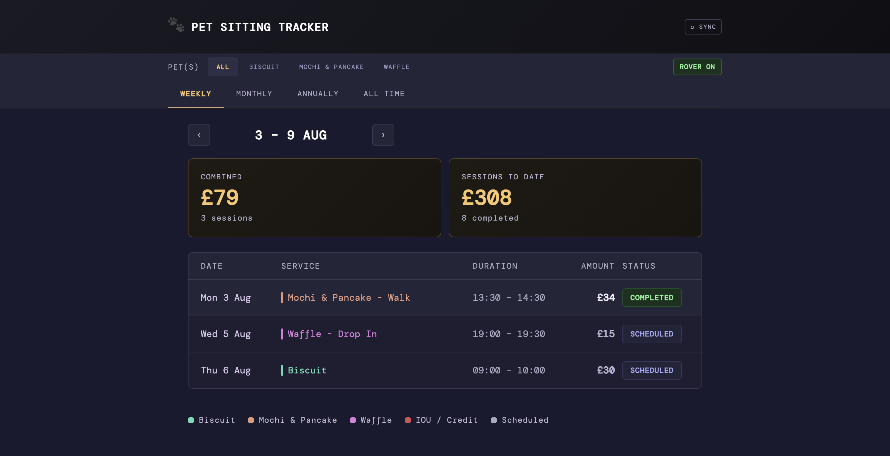
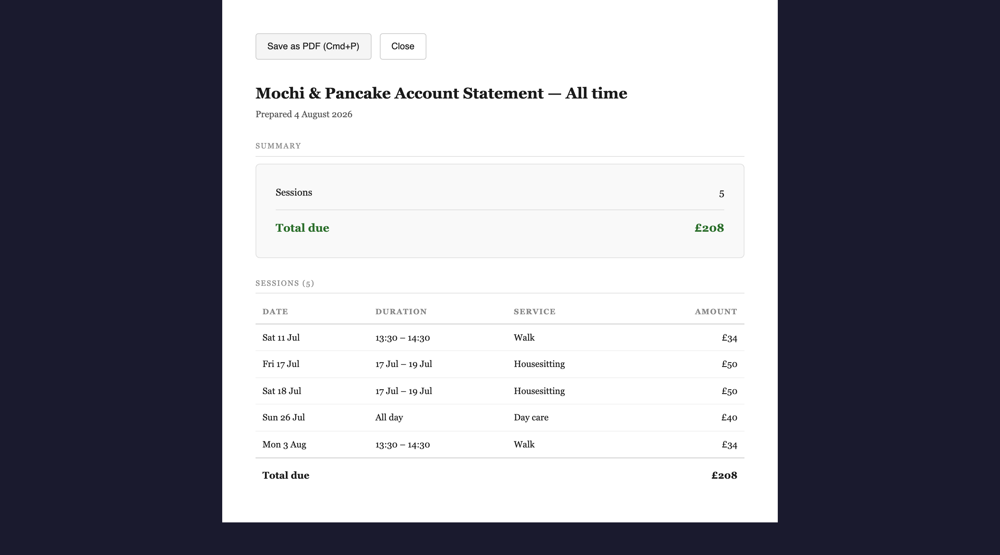
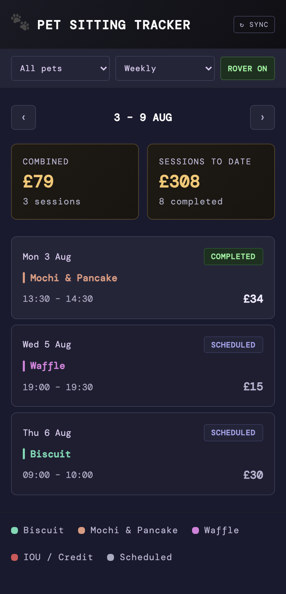
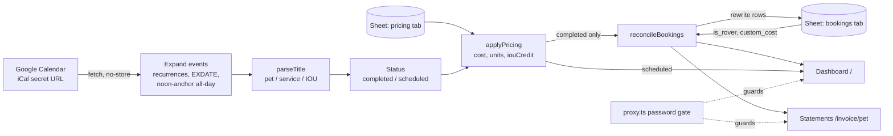

# Pet Sitting Manager

A dashboard that turns a pet sitter's Google Calendar into priced booking history, weekly and monthly takings and printable client statements, with no database and no data entry beyond the calendar.



## At a glance

| | |
|---|---|
| **What it is** | Next.js web app, installable on a phone as a PWA (progressive web app), for a one-person pet-sitting business. Google Calendar (via its iCal feed) is the source of truth; a Google Sheet holds history, rates and manual overrides. No database |
| **Who uses it** | The business owner |
| **Stack** | Next.js 16 (App Router) · React 19 · Tailwind 4 · TypeScript · node-ical · Google Sheets API · Vercel |
| **Status** | In use since April 2026; rebuilt on Google Sheets in July 2026 |
| **Repo** | Private (real client data). This folder is the spec. Screenshots and examples use demo data |

**Supporting files**

- [`pricing.md`](./pricing.md): the full pricing rules, with worked examples for every rate unit.
- [`screenshots/`](./screenshots): dashboard (desktop and mobile) and a client statement, all demo data.

## The problem

The business already lived in Google Calendar: every walk, run, drop-in, day care and housesit is an
event. Working out what each client owes meant scrolling the calendar and doing sums by hand, with
rates that differ per pet and per service, a cheaper rate for the second run of the week, nights vs
days for housesitting, prepaid "IOU" sessions (already paid for, so they earn no new revenue), and agency bookings that must never be invoiced
twice. The owner wanted to keep using the calendar exactly as before.

## What it does

1. **Keeps using the calendar.** The owner types events like `🐕 Mochi & Pancake - Walk`. Nothing
   else is entered anywhere.
2. **Parses each title** into pet, service and IOU flag (grammar in Rules & logic), and ignores unrelated events
   (dentist, birthdays).
3. **Prices each booking** from a rate table in the Sheet ([full rules: pricing.md](pricing.md)).
4. **Dashboard**: Weekly / Monthly / Annually / All time views; filter by pet; a toggle to hide agency
   (Rover) bookings; two summary cards (period total, and completed takings "to date" up to the end
   of the period); each row shows date, title, duration, amount and COMPLETED / SCHEDULED.
5. **Statements**: pick a pet and period → a print-ready statement, multi-day stays itemised per
   day, saved to PDF via the browser.
6. **Sheet history**: completed bookings are mirrored into a `bookings` tab so the owner has a
   spreadsheet record, plus two hand-editable override columns.

<p align="center">
  
  &nbsp;
  
</p>

### Example: one week, calendar in → dashboard out

Calendar for the week of Mon 3 Aug (demo pets):

| Calendar event | Parsed as | Priced |
|---|---|---|
| Mon 3 Aug 13:30–14:30 `🐕 Mochi & Pancake - Walk` | Mochi & Pancake · walk | £34 per_session |
| Wed 5 Aug 19:00–19:30 `🐈 Waffle - Drop In` | Waffle · dropin | £15 per_session |
| Thu 6 Aug 09:00–10:00 `🐕 Biscuit` | Biscuit · run (pet default) | £30 first run of the week |
| Thu 6 Aug `Dentist` | ignored (no booking signal) | — |

Viewed on Tue 4 Aug, the dashboard shows the Monday walk as COMPLETED and the other two as
SCHEDULED; the COMBINED card shows **£79 · 3 sessions** (scheduled bookings count towards the
period's expected total). This is the screenshot above.

### Example: a statement

Mochi & Pancake, "All time" (screenshot above): two walks (£34 each), a housesit Fri 17 – Sun 19 Jul
priced at 2 nights × £50 and itemised as two £50 lines, one day care (£40). **Total due £208.**

## Architecture



| Part | Role |
|---|---|
| **Google Calendar** | Source of truth. Read via its private iCal URL (no OAuth). |
| **Event expansion** (`events-server.ts`) | Parses the ICS with node-ical, expands recurring events between 2025-01-01 and now + 2 years, applies EXDATEs, cancelled and moved/renamed occurrences, noon-anchors all-day dates. |
| **Pure logic** (`events.ts`) | No I/O: parse titles, compute status, price, format dates/money, itemise per day, pet colours. |
| **Sheets client** | Service-account JWT (`google-auth-library`), plain REST calls to Sheets v4, no SDK. |
| **Reconcile** (`sessions-sheet.ts`) | Makes the `bookings` tab match the calendar while preserving manual overrides. |
| **Pages** | `/` dashboard and `/invoice/[pet]` statements are server-rendered on every request (`force-dynamic`), so each view is a live sync. `POST /api/sync` runs a sync and reports success or the exact failure. |
| **Auth** | One shared password; an HMAC-signed cookie checked by Next 16's `proxy.ts` (formerly middleware). |

## Data model

### In-memory `Session`

| Field | Meaning |
|---|---|
| `id` | iCal `UID`; recurring occurrences are `UID_<occurrence start ISO>` |
| `title` | Raw calendar title |
| `start`, `end` | Instants. All-day: noon UTC of start date → noon UTC of exclusive end date |
| `pet` | Parsed pet name (the rate key and statement key) |
| `client` | Owner from the pricing directory (unused in UI) |
| `serviceType` | `run` · `walk` · `daycare` · `housesitting` · `dropin` |
| `isIOU`, `isRover`, `customCost` | Flags (IOU from title; the other two from the Sheet) |
| `cost` | Delivered revenue; 0 for IOU |
| `iouCredit` | Value of an IOU booking; 0 otherwise |
| `units` | Nights / days charged, else 1 (drives per-day itemisation) |
| `status` | `completed` or `scheduled` |

### Sheet `bookings` tab (managed by the app)

Columns found by **header name** (normalised: lowercase, spaces/hyphens → `_`); extra columns are
allowed and left blank on write.

| Column | Req. | Written as | Notes |
|---|---|---|---|
| `id` | yes | booking id | join key for overrides |
| `title` | yes | raw title | |
| `start_at` | yes | `YYYY-MM-DD HH:mm:ss` London time, `USER_ENTERED` → native date | all-day: `<first day> 09:00:00` |
| `end_at` | yes | same | all-day: `<last covered day> 17:00:00` |
| `pet` | yes | pet name | |
| `is_rover` | no | boolean | **hand-edited**: TRUE keeps it off statements |
| `custom_cost` | no | boolean | **hand-edited**: TRUE freezes `cost` |
| `cost` | yes | number; blank for IOU | `SUM(cost)` = delivered revenue |
| `iou_credit` | no | number for IOU rows, else blank | |
| `service_type` | no | service | |

Only **completed** bookings are written; one row per booking (not per night), sorted by start.

### Sheet `pricing` tab (hand-maintained)

`pet · service · rate_unit · rate` (required) + `client`, `effective_from` (optional). Full rules and
worked examples: [pricing.md](pricing.md).

## Rules & logic

### Title-parsing grammar

```
title   := [emoji…] [IOU [-]] part ( " - " part )*
part    := pet name | service keyword
```

Algorithm (`parseTitle`):

1. Trim. Empty → not a booking.
2. Note whether the title contains an emoji (U+1F300–U+1FAFF or U+2600–U+27BF), the "booking signal".
3. Strip leading non-letter/non-digit characters (emoji, spaces). Internal `&` is kept.
4. If the word `IOU` appears (case-insensitive, whole word): set `isIOU`, remove it and any
   leftover leading/trailing dashes or spaces.
5. Legacy: if what's left is exactly `Dog Walk` → one specific regular's walk (a pre-convention
   title kept so old events still price).
6. Split on ` - ` (space-dash-space).
   - **2+ parts**: the first part matching a service keyword is the service; all other parts,
     re-joined with ` - `, are the pet. No part matches → whole thing is the pet.
   - **1 part**: if it matches a service keyword anywhere, return *not a booking* (logged as "no pet
     name"); otherwise it's the pet.
7. Strip trailing `?` from the pet. Empty pet → not a booking.
8. **Booking signal check**: no emoji AND no service AND not IOU → not a booking.
9. No service → per-pet default (a small code map, e.g. Biscuit → `run`), else `walk`.

Service keywords (first match wins, case-insensitive):

| Regex | Service |
|---|---|
| `house\s*-?\s*sit(ting)?` or `housitting` (common typo) | `housesitting` |
| `day\s*-?\s*care` | `daycare` |
| `drop\s*-?\s*in` | `dropin` |
| `\brun\b` | `run` |
| `\bwalk\b` | `walk` |

Examples:

| Title | pet | service | IOU |
|---|---|---|---|
| `🐕 Mochi & Pancake - Walk` | Mochi & Pancake | walk | no |
| `🐈 Waffle - Drop In` | Waffle | dropin | no |
| `🐕 Biscuit` | Biscuit | run (pet default) | no |
| `🐈 Waffle` | Waffle | walk (global default) | no |
| `🐕 IOU - Biscuit` | Biscuit | run | **yes** |
| `Mochi & Pancake - House-sitting` | Mochi & Pancake | housesitting (no emoji needed: service is the signal) | no |
| `Day Care - Mochi & Pancake` | Mochi & Pancake | daycare (order doesn't matter) | no |
| `🐕 Waffle?` | Waffle | walk (`?` stripped) | no |
| `🐕 Biscuit - Mochi - Walk` | Biscuit - Mochi | walk | no |
| `Housesitting` | — skipped, no pet | | |
| `🐕 Biscuit walk` (no ` - `) | — skipped: single part containing a service word | | |
| `Dentist` | — skipped, no booking signal | | |

### Pricing

See [pricing.md](pricing.md): rate lookup (exact pet beats `*`, latest `effective_from` wins), unit
order (`first_weekly` → `per_session` → `per_night` → `per_day`), nights = days − 1, Monday-based week
position, IOU → credit, overrides. Worked examples for every unit.

### Timezone rules

All display and date-only comparisons use **`Europe/London`**, the calendar's zone.

1. **All-day bookings are noon-anchored.** node-ical turns `DTSTART;VALUE=DATE:20260717` into local
   midnight of the parsing machine. Taking that machine's local Y/M/D and building
   `Date.UTC(y, m, d, 12:00)` puts the instant 12 hours from either midnight, so formatting it in any
   zone from UTC−11 to UTC+11 yields the right date. End stays **exclusive** (a 17–19 Jul stay has end
   = 20 Jul 12:00Z).
2. **All-day detection** without extra state: `end − start > 0` and an exact multiple of 24 h.
3. **Formatting is pinned** with `toLocaleDateString(..., { timeZone: "Europe/London" })` everywhere.
   The dashboard renders in the browser, statements on a UTC Vercel server; unpinned, timed sessions
   on statements printed an hour early in summer.
4. **"Is it finished?"** (completed vs scheduled):
   - Timed: `end < now` (exact instant).
   - All-day: `londonDate(now) >= londonDate(end)`, i.e. done once the last covered London day has
     passed. (Comparing instants would leave yesterday's day care "scheduled" until noon today, since
     its end is noon of the exclusive end date.)
5. **Recurrence override matching**: EXDATE / RECURRENCE-ID entries (the iCal fields that mark a recurring event's cancelled or moved occurrences) are looked up under three keys
   per occurrence (local date, UTC date, full ISO), because for all-day events in BST the UTC date is
   a day earlier and overrides were otherwise missed, reverting renamed occurrences to the master
   title.
6. **Sheet times** are written as London wall-clock strings so the owner sees local times.

### Reconcile algorithm (`reconcileBookings`)

Runs on every dashboard load, statement load and SYNC press.

```
fetch calendar
if fetch failed or threw:
    serve Sheet rows read-only (all treated as completed, no scheduled), or built-in demo data
    → NO writes
parse + price everything; split into completed and scheduled
reconcile(completed):
    no Sheet credentials          → return calendar data, sheetError "not configured"
    read bookings tab; read fails → return calendar data, sheetError, NO write
    required header missing       → return calendar data, sheetError naming the columns, NO write
    for each completed booking b:
        ex = sheet row with same id
        b.isRover    = ex?.is_rover    ?? false
        b.customCost = ex?.custom_cost ?? false
        b.cost       = (ex && ex.custom_cost) ? ex.cost : b.cost
    sort by start
    PUT rows 2..N+1 in the Sheet's current column order (one request)
    if the Sheet previously had more rows: clear the leftover rows
    return { sessions: final, sheetError: null | write error }
result = reconciled completed + scheduled, sorted by start
```

Properties:

- **Calendar-authoritative**: rows whose event was deleted disappear; edited events (time, title,
  pet) overwrite their row. Overrides survive because they're keyed by id.
- **Idempotent**: same calendar + same Sheet → identical write.
- **Never writes after a failed read** of either source, so an outage can't wipe history or overrides.
- **Never throws**: the dashboard always renders; failures surface as `sheetError`.
- `/api/sync` returns `ok: true` only if the calendar loaded **and** `sheetError` is null; the toast
  shows the server's actual reason otherwise (kept on screen 10 s).

### Dashboard rules

- Week = Monday–Sunday in the viewer's local time; prev/next arrows step by period; a "THIS WEEK /
  MONTH / YEAR" button returns to now (disabled, not hidden, when already there).
- Period card: sum of `cost` over non-IOU bookings in the period, **including scheduled**.
- "Sessions to date" card: completed, non-IOU bookings with start ≤ end of the selected period.
- IOU rows: red, shown as `−£credit`, excluded from both cards.
- ROVER ON/OFF: client-side filter.
- Pet colours: hue = `(18 + i × 137.508°) mod 360` (golden angle) at HSL(·, 52 %, 68 %), with `i` =
  order of each pet's first-ever booking, so colours are distinct, never hard-coded, and stable as
  pets are added.
- Auto-refresh when the app regains focus and data is more than 60 s old (iOS resumes PWAs rather
  than reloading them).

### Statements (`/invoice/[pet]?from&to&label`)

- Opened from the dashboard ("VIEW STATEMENT →", visible only when one pet is selected, using the
  current period) or from `/invoice` (pet + month picker, defaulting to last month).
- Pet resolved by slug: lowercase, non-alphanumerics → `-`.
- Line items: that pet's bookings that are **completed**, **not IOU**, **not Rover**.
- **Itemise before filtering by period**: multi-day all-day bookings are split into one line per
  charged unit (`expandDaily`: `units` lines, each `cost / units`, dated start + i days). So a
  housesit spanning a month end lands its nights in the right months.
- Duration column shows the **whole** booking span on every line (`17 Jul – 19 Jul`); timed
  bookings show `13:30 – 14:30`; day care always shows "All day", even if entered as timed.
- Summary: session (line) count and total due. "Excludes Rover bookings" note appears only if the
  period contained any.
- "Save as PDF" calls `window.print()`; print CSS hides the buttons.

### Auth

- `APP_PASSWORD` checked at `POST /api/login`; cookie `dw_session` = HMAC-SHA256(key = password,
  message = fixed string), httpOnly, 30 days. Web Crypto, so it works in the edge proxy and in Node.
- `proxy.ts` redirects everything to `/login` except `/login`, `/api/login`,
  `/manifest.webmanifest` and static assets. Changing the password logs everyone out.

## Key decisions

| Decision | Why | Rejected alternative |
|---|---|---|
| Calendar is the only input; titles carry the data | The owner already lived in the calendar; zero new habits, works from the phone's calendar app | A booking form / admin UI (double entry, would drift from the calendar) |
| Google Sheet instead of a database | Owner can see, sort and hand-edit history and rates in a familiar tool; free | Supabase (the first version, removed in July 2026: auth, schema and hosting overhead for one user) |
| Reconcile = rewrite the whole tab from the calendar, overlay two override columns | Simple, idempotent, deletions handled for free; small data (hundreds of rows) | Incremental upserts/deletes keyed by id (more code paths, more ways to drift) |
| Write only after a successful calendar read | An iCal outage must never look like "all bookings deleted" | Writing whatever was fetched |
| Match Sheet columns by header name; refuse to write if a required one is missing | The owner edits the Sheet; reordering columns must not shift data into wrong fields | Fixed column positions (an earlier version risked exactly this) |
| Rates in a Sheet tab, with `*` wildcard and `effective_from` | Price changes are a row edit, not a deploy; old bookings keep old prices | Rates in code |
| Pricing is a pure function, re-run on every sync | Fixing a rate or a parse rule corrects history automatically | Storing price at booking time (needs migrations when rules change); `custom_cost` covers the exceptions |
| IOU = £0 revenue + separate `iou_credit` column | `SUM(cost)` stays true delivered revenue; credit still visible | A negative cost (would corrupt totals) |
| Agency bookings flagged in the Sheet, not the title | It's a billing fact, not a scheduling one; one checkbox | A title keyword |
| Noon-anchor all-day dates, pin formatting to Europe/London | Browser and UTC server must agree; dates must survive any timezone | Storing date strings separately (two representations to keep in sync) |
| Single shared password, HMAC cookie | One user; no accounts to manage | OAuth / user accounts |
| Server-render every page live (`force-dynamic`) | Every view is a fresh sync; no cron, no stale cache | Scheduled background sync |
| Statements via browser print | PDF for free, no PDF library | Server-side PDF generation |

## Failure modes & lessons

| What happened | Fix / design answer |
|---|---|
| All-day bookings shown a day early on a BST machine (node-ical's local-midnight dates) | Noon-anchoring |
| Renamed or deleted occurrences of recurring bookings reverted to the master title | Look up overrides under local, UTC and ISO keys; value-based matching in the package |
| Statement times an hour early in summer (server formats in UTC) | Pin all formatting to Europe/London |
| Yesterday's day care still "scheduled" until lunchtime | Date-based completion check for all-day bookings |
| SYNC toast said "Synced" while Sheet writes were silently failing (caught and swallowed) | `reconcileBookings` returns `sheetError`; `/api/sync` only reports success if the Sheet was written; toast shows the real reason |
| "Add to Home Screen" missed the app name/icons | Serve the web manifest without the password gate |
| Column reorder risk in a hand-edited Sheet | Header-name mapping + refuse-to-write guard |

## Rebuild spec

### Accounts and setup

1. **Google Calendar**: Settings → the calendar → "Secret address in iCal format". Copy the URL.
2. **Google Cloud**: create a project, enable the Google Sheets API, create a service account and a
   JSON key.
3. **Google Sheet**: create tabs `bookings` (headers as in the table above) and `pricing` (headers
   `pet, service, rate_unit, rate, client, effective_from`); share the Sheet with the service account
   email as Editor.
4. **Vercel**: Hobby project connected to the repo; set the env vars; auto-deploy on push to `main`.

### Env vars (names only)

| Name | Purpose |
|---|---|
| `GOOGLE_CALENDAR_ICAL_URL` | iCal secret address. Unset → built-in sample data |
| `APP_PASSWORD` | Shared login password |
| `GOOGLE_SHEET_ID` | Spreadsheet ID |
| `GOOGLE_SERVICE_ACCOUNT_EMAIL` | Service account email |
| `GOOGLE_SERVICE_ACCOUNT_PRIVATE_KEY` | PEM key on one line with literal `\n` (restored at runtime) |

Every integration degrades gracefully: no calendar URL → sample events; no Sheet → `DEFAULT_PRICING`
and no writes (reported as a sync error).

### Build plan

1. `create-next-app` (Next 16, App Router, TypeScript, Tailwind 4). Dependencies: `node-ical`,
   `google-auth-library`.
2. `lib/events.ts` (pure): types; `parseTitle` per the grammar; `parseSessions` (dedupe by id, sort,
   status rule); `lookupRate` + `applyPricing` per [pricing.md](pricing.md); London formatters;
   `isAllDay`; `fmtDuration`; `expandDaily`; `fmtMoney` (`£34`, `£12.50`); golden-angle colours.
   Unit-test every example table in this folder.
3. `lib/events-server.ts`: fetch iCal (`cache: 'no-store'`), expand recurrences 2025-01-01 → now+2y
   with EXDATE/override/cancel handling and noon-anchoring; orchestrate fetch → price → reconcile, returning
   `{ sessions, calendarLoaded, sheetError }`.
4. `lib/google-sheet.ts`: cached JWT client, scope `spreadsheets`.
5. `lib/pricing-sheet.ts`: read `pricing!A1:Z` with `UNFORMATTED_VALUE`, header-map, validate, fall
   back to defaults.
6. `lib/sessions-sheet.ts`: header-mapped read; reconcile exactly as specified (guards, overlay, PUT
   with `USER_ENTERED`, clear trailing rows).
7. `lib/auth.ts`, `proxy.ts`, `/login` page, `POST /api/login`.
8. `POST /api/sync` with the honest-success rule.
9. Dashboard (client component fed by a `force-dynamic` server page): views, period navigation,
   pet chips / mobile dropdowns, Rover toggle, summary cards, table (desktop) + cards (mobile),
   toast, focus auto-refresh.
10. `/invoice` picker and `/invoice/[pet]` statement per the statement rules; print CSS.
11. PWA manifest + icons (manifest public).
12. Deploy to Vercel; check a timed and an all-day booking show the same dates on dashboard and
    statement.

## Known limits

- Single user, single calendar, GBP only, no VAT; statements aren't numbered invoices and nothing
  tracks payment.
- No-service defaults per pet and the legacy `Dog Walk` alias live in code, not the Sheet.
- Week grouping for tiered pricing and day counting use the **server's** local time (UTC on Vercel),
  so a run booked between 00:00 and 01:00 BST on a Monday counts towards the previous week.
- A timed booking of exactly 24 h (or a multiple) would be treated as all-day.
- Fallback mode (calendar down) reads Sheet rows back without the noon anchor: all-day stays show as
  09:00–17:00 timed bookings, aren't itemised per night, and summer times can read an hour off.
- Repricing is retroactive by design; only `custom_cost` truly freezes a price.
- The whole `bookings` tab is rewritten on each sync: fine for hundreds of rows, not for tens of
  thousands, and hand-edits to columns other than the two override columns are overwritten.
- Owner names from the pricing tab are loaded but not shown.
