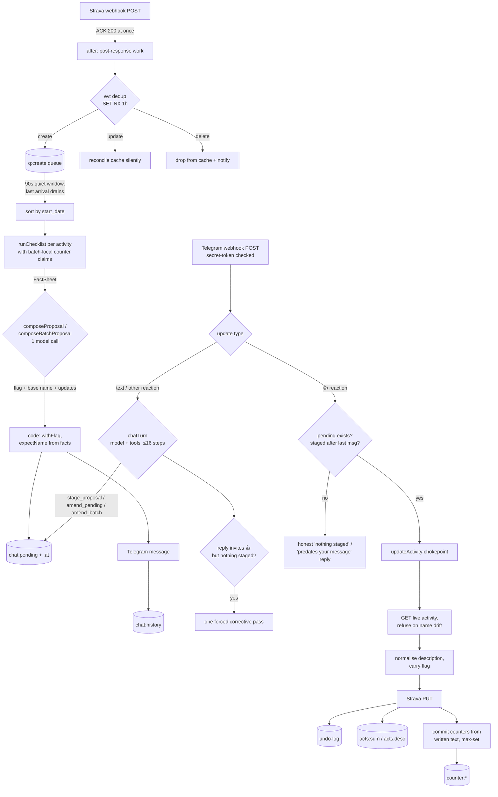
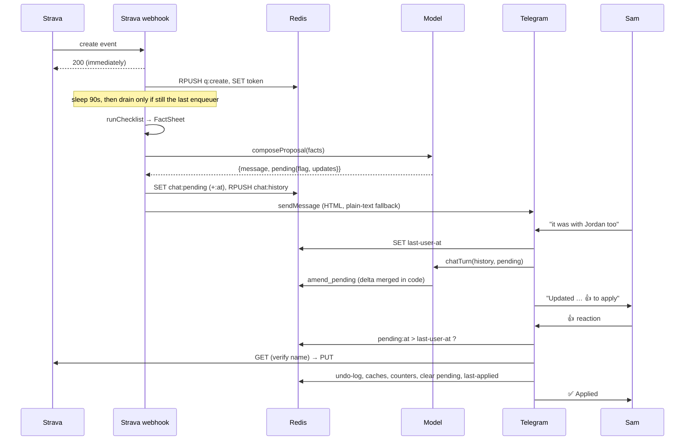

# Strava Logging Agent

An LLM agent that keeps a six-year Strava journal in order, where code works out every fact, the model adds judgement and wording, and nothing is written until the athlete gives a 👍.

> Examples in this folder use the **fictional persona**: athlete *Sam*, partner *Jordan*,
> friends *Morgan* and *Casey*, dogs *Scout*, *Poppy & Bear* and *Pepper*, employer *HQ*, and the parks
> *Northgate Common* and *Kingsway Park*. The rules, algorithms, thresholds and incidents are the real
> production ones, with the names changed.

## At a glance

| | |
|---|---|
| **What it is** | A Telegram bot plus two serverless webhooks. It renames new Strava activities, writes their descriptions (counters, companions, weather, hills) and fixes sport type, gear and feed muting, all by following a plain-English rulebook |
| **Who uses it** | One athlete (the author), daily. Journal of ~1,600 activities from June 2020 onwards |
| **Stack** | Next.js 16 (App Router, route handlers only) · TypeScript · Vercel serverless (`after()`, which runs work after the response is sent) · Upstash Redis · Vercel AI SDK v7 + AI Gateway (model-agnostic, currently Claude Sonnet) · Zod · Telegram Bot API · Strava API v3 · Open-Meteo. ~1,500 lines of `src`; no database, no server, no UI |
| **Status** | Live in production since **9 July 2026**. ~1,360 verified corrective edits in the launch clean-up. Runs on a Strava API subscription (~£9/mo, which Strava requires of every app owner) plus a few pounds a month of model usage |
| **Repo** | Private (real locations and people). This folder is the spec. |

**Supporting files**

- [`RULES.example.md`](./RULES.example.md): **the rulebook**, which is the product. It is loaded as the model's system prompt, so editing it changes behaviour. Sanitised, and up to date with production as of October 2026.
- [`lessons.md`](./lessons.md): "design lessons already paid for", every production failure and the rule it led to.
- [`tools.md`](./tools.md): the model's tool contracts (inputs, outputs, and what code enforces).
- [`fact-sheet.example.json`](./fact-sheet.example.json): a complete example `FactSheet`, the typed object the model receives.

## The problem

For six years the athlete kept a careful Strava journal by hand. Every activity got a country flag and a series
number (`Scout #65`, `HQ Commute #83.2`). Some also got distance and park counters (`Half Marathon #39`,
`Northgate Common #258`), a companion line, and weather and hill lines written by five third-party apps. Doing
this by hand is tedious and easy to get wrong: one counter slip throws off every later number. A naive LLM agent is
worse, because it miscounts confidently and rewrites the athlete's own words.

## What it does

1. A new activity syncs, and Strava sends a webhook.
2. Code runs a **10-step checklist** and builds a typed **FactSheet** (one object holding every fact code has worked out): duplicate check, series, sport/gear fix,
   flag, counters, park boundaries, Monthly 21k, commute leg, weather, hills, muting.
3. The model makes **one call** with that fact sheet. It judges the genuinely ambiguous points (is this Ride a
   commute? is this 7am Tuesday workout Circuits?), writes the Telegram message, and returns a structured update.
4. Code **stages** that update in Redis and sends the proposal to Telegram.
5. Sam replies with 👍 (apply exactly what is staged) or plain English ("it was with Jordan too", "not a
   commute"). A correction is merged into the staged object, and a 👍 then applies the corrected version.
6. One function performs every write. It re-reads live state, refuses if the activity has changed, enforces the
   description layout, logs the before-state for undo, writes to Strava, and advances counters from the text it
   actually wrote.

Between activities Sam can also ask it questions ("how many Friday runs with Morgan this year?", "last ride over
100 km?"). It answers from an exhaustive search tool, not from memory.

### Example 1: a proactive proposal (Telegram)

```
New run synced — here's the checklist:
1. Duplicate check: none.
2. Series: starts 40 m from home → Scout #65 (Scout runs are TrailRun → trail shoes).
3. Sport/gear: logged as Run → change to TrailRun + Trailblaze GTX.
4. Flag: 🏴󠁧󠁢󠁥󠁮󠁧󠁿 England (from GPS).
5. Boundaries: enters Northgate Common → Northgate Common #258. Does not enter Kingsway Park.
6. Distance: 21.4 km ≥ 21.1 → Half Marathon #39. Not the October 21k (an earlier ≥21.1 km run
   already happened this month). Not a marathon.
7. Weather: Cool and partly cloudy (11°C).
8. Hills: Northgate Rise (58 m).
9. Muting: a run → stays on the feed.

Proposed name: 🏴󠁧󠁢󠁥󠁮󠁧󠁿 Scout #65
Proposed description:
  Half Marathon #39
  Northgate Common #258

  w/ Scout

  Weather: Cool and partly cloudy (11°C).

  Hills: Northgate Rise (58 m)

Want to add the story? 👍 to apply.
```

Negatives are listed too ("does not enter Kingsway Park"), so Sam can see no step was skipped.

### Example 2: a correction, then approval

```
Sam:   it was with Jordan too
Agent: [calls amend_pending {companions: ["Jordan", "Scout"]}]
       Updated — description now reads "w/ Jordan & Scout". 👍 to apply.
Sam:   👍                                            (reaction on the message)
Bot:   ✅ Applied: 🏴󠁧󠁢󠁥󠁮󠁧󠁿 Scout #65                 (emitted by code, never by the model)
```

The model passes only the **delta**. Code rebuilds the single alphabetical `w/` line in the right place, so an
existing companion can't be dropped.

### Example 3: a burst sync (post-holiday) becomes one digest

A post-holiday sync fires three create events within seconds. They are queued, sorted by **start time** (not arrival
order), and numbered in sequence with batch-local claims, so two Scout runs in one burst become #66 and #67, never
two #66s. The result is one message:

```
3 activities synced:
1. Sat 7 Nov — 🇫🇷 Morning Run → 🇫🇷 November 21k; Half Marathon #40 …
2. Sun 8 Nov — 🇫🇷 Afternoon Walk (flag added, muted) …
3. Mon 9 Nov — Morning Ride → 🏴󠁧󠁢󠁥󠁮󠁧󠁿 HQ Commute #84.1 (commute flag + City Commuter) …
👍 applies ALL of them; or reply about any numbered item to adjust it.
```

"1. call it Lakeside Loop, 2. was with Casey" restages both items in **one** `amend_batch` call.

### Example 4: a question

```
Sam:   when was my last ride over 100km?
Agent: [search_history {sport:"Ride", min_km:100}] → total: 7, latest: 2025-06-14, 128.3 km
       14 June 2025, the coast ride (128.3 km). That's the most recent of 7 rides over 100 km.
```

## Architecture



| Part | File (in the source repo) | Job |
|---|---|---|
| Strava door | `app/api/strava/webhook/route.ts` | GET echoes `hub.challenge` (with verify token). POST ACKs immediately and does the work in `after()`: dedup, create→queue, update→silent cache reconcile, delete→cache drop + note. `maxDuration = 300` |
| Telegram door | `app/api/telegram/webhook/route.ts` | Checks `x-telegram-bot-api-secret-token`, allows only the one chat ID. 👍 reaction → guarded apply. Any text → `chatTurn`. Legacy Apply/Skip button taps still get an honest answer |
| Checklist | `lib/pipeline.ts` | `runChecklist(raw, claims)` → `FactSheet`. Every deterministic decision |
| Agent | `lib/agent-prod.ts` | System prompt (conduct rules + `RULES.md` + learned amendments), the tools, `composeProposal`, `composeBatchProposal`, `chatTurn` |
| Write chokepoint | `lib/strava-server.ts` | Token refresh under lock, `updateActivity` (verify → normalise → flag carry → PUT → undo log → cache → counters) |
| Description | `lib/description.ts` | `normalizeDescription`, `setCompanions`, `formatCompanionLine`, `LEADING_FLAG` |
| Geo | `lib/peaks.ts`, `lib/rp-boundary.ts` | Polyline decode, point-in-polygon with holes, hill detection by point-to-segment distance |
| Weather | `lib/weather.ts` | Open-Meteo hour → deterministic adjective line |
| State | `lib/store.ts` | All Redis keys (below) |
| Config | `config/*.json/.geojson` | Hill catalogue (a subset of DoBIH, the Database of British and Irish Hills), two park polygons, gear registry. Bundled into the functions with `outputFileTracingIncludes` alongside `RULES.md` |

### The Telegram flow (sequence)



## Data model

Redis is the only live state. There is no database. Local `data/` files from the pre-launch period are out of date and must never be trusted.

| Key | Type | TTL | Meaning |
|---|---|---|---|
| `strava:tokens` | JSON `{access_token, refresh_token, expires_at}` | — | OAuth tokens for the one athlete |
| `lock:refresh` | string | 10 s (`NX PX`) | Only one instance refreshes tokens; the others wait 1.5 s and re-read |
| `acts:sum` | hash id → slim summary JSON | — | The journal: `id, name, sport_type, distance (m), moving_time (s), start_date, start_date_local, start_latlng, gear_id, hide_from_home, total_photo_count, …` |
| `acts:desc` | hash id → string | — | Descriptions (Strava's list endpoint omits them) |
| `counter:hm` / `:marathon` / `:wc` / `:rp` | int | — | Half Marathon, Marathon, park A (Northgate Common), park B (Kingsway Park) |
| `counter:series:<slug>` | int | — | e.g. `scout`, `pb`, `circuits`, `pepper`, `striders`, `hq-run`, `hq-workout`, `hq-commute-day` (the N of `#N.1`) |
| `chat:<id>:history` | list of `{role, content}` | trimmed to the last 40 | **One thread for both doors**. The last 20 are sent to the model |
| `chat:<id>:pending` | `Pending` or `{items: Pending[]}` | 48 h | **The** proposal that 👍 executes |
| `chat:<id>:pending:at` | epoch ms | 48 h | When it was staged (staleness guard) |
| `chat:<id>:last-user-at` | epoch ms | 48 h | When Sam last sent text |
| `chat:<id>:last-applied` | activity id | 6 h | Anchor for "that was also with Jordan" after ✅ Applied |
| `q:create` | list of ids | — | Create events waiting for the quiet window |
| `q:create:token` | uuid | — | Identity of the most recent enqueuer, who owns draining |
| `q:create:lock` | string | 240 s (`NX`) | Only one drain at a time |
| `evt:<id>:<aspect>:<updates-json>` | string | 1 h (`NX`) | Webhook dedup (Strava retries) |
| `learned` | list of strings | — | Rules Sam confirmed in chat (`record_rule`), `- [YYYY-MM-DD] rule`. Same force as the rulebook |
| `undo-log` | list of JSON | — | `{ts, id, before (full slim activity), after (updates sent), via}` for every write |
| `usage-log` | list of JSON | — | `{ts, model, input, output, steps}` per model call (`get_spend` reads it) |

```ts
type Pending = {
  activityId: number;
  expectName: string;        // live name at staging time — ALWAYS set by code, never the model
  updates: { name?; description?; sport_type?; gear_id?; commute?: boolean; hide_from_home?: boolean };
  summary: string;           // one line, for confirmations
};
type PendingSet = Pending | { items: Pending[] };   // a 👍 applies every item
```

The `FactSheet` type is shown in full in [`fact-sheet.example.json`](fact-sheet.example.json).

## Rules & logic

The athlete-facing rules are in [`RULES.example.md`](RULES.example.md). This section covers the algorithms the code
runs.

### The FactSheet pipeline (`runChecklist`)

| # | Step | Exact logic |
|---|---|---|
| 1 | Duplicate | Any cached activity with the **same `sport_type`** whose `start_date` is **< 180 s** away → `duplicateOf {id, name}`. The proposal keeps the complete recording and gives a `strava.com/activities/<id>` link, because the API can't delete |
| 2 | Series (GPS) | `start_latlng` within **120 m** (haversine, i.e. great-circle distance) of the home base → `Scout`, any sport. Else a **Walk** within **200 m** of the dog-sit house → `P&B`. `nextNumber = max(peek(counter), batchClaim) + 1`. On no match the reason gives the **real distances** to both triggers, so the model can't make them up |
| 2b | Pattern evidence | For series with no GPS trigger (Circuits, HQ Commute): the 8 most recent same-sport activities and the 5 most recent on the same weekday, each as `name — date (Dow) HH:MM, Nmin`. The model weighs these against the glossary |
| 3 | Sport/gear | Scout series and typed `Run` → `{to: TrailRun, gear_id: <trail shoes>}`. (The Strava app swaps gear when the type changes; the API doesn't, so code always sets both) |
| 4 | Flag | GPS present → model derives from coordinates (border caution is a judgement call). No GPS and home timezone → **the answer itself** (`🏴󠁧󠁢󠁥󠁮󠁧󠁿`, verbatim). No GPS and another timezone → hint with the timezone |
| 5–7 | Counters | Run/TrailRun `distance ≥ 42 200 m` → `marathon`. `≥ 21 100 m` → `halfMarathon` (both can apply). Route enters park A / park B polygon → `wc` / `rp`. **Peek only.** Nothing increments here |
| — | Monthly 21k | Run/TrailRun ≥ 21 100 m and **no earlier** ≥ 21 100 m Run/TrailRun in the same local `YYYY-MM` → `qualifies: true` (name it `<Month> 21k`). Later ones still earn Half Marathon #N |
| — | Commute leg | For any `Ride`: same local day already has `HQ Commute #D.L` names → `{dayNumber: max D, nextLeg: max L + 1}`. Otherwise `{peek(hq-commute-day)+1, 1}`. Legs are numbered **by order within the day, not direction**. Whether the ride *is* a commute is left to the model |
| 8 | Weather | If GPS: Open-Meteo for the local hour → `"Weather: " + describeWeather(h)`. A failure gives `null`, never a guess |
| 9 | Hills | Decoded polyline → `"Hills: " + peaksLine(pts)` or `null` |
| 10 | Muting | `shouldBeMuted = sport_type === 'Walk'` (all walks muted, nothing else) |

The fact sheet carries `slim(raw)`, never the raw blob: the polyline never goes into the prompt.

### Geo algorithms (all in code, no geo service)

- **Polyline decode**: standard Google encoded polyline → `[lat, lon]` at 1e-5.
- **Boundary**: ray-casting point-in-polygon. A route "enters" if **any** vertex is inside the outer ring and
  outside every hole. Park A is a hand-drawn 197-point ring with 3 exclusion holes; park B is an OSM boundary.
- **Hills**: catalogue bucketed into a 0.1° grid. Candidates come from the cells the route touches plus a one-cell
  buffer. A hill is bagged if its **distance to any route segment** (not vertex) is **≤ 75 m**, using a
  local equirectangular projection (`dLon·cos(lat)`, × 111 320 m/°). Output is in route order:
  `Name (NN m) / Name (NN m)`. Backtested against the third-party app it replaced: **127/129 exact, zero false
  positives**.
- **Hill ≠ boundary**: a route can pass within 75 m of a summit named after a park without crossing the
  park polygon. Boundary counters read **only** from the polygon test.

### Weather line

The mapping is deterministic, so the same conditions always give the same words. Words go in a fixed order: temperature, sky/precipitation, (muggy), light, wind, then the **actual** temperature
in brackets.

| Slot | Rule (first match wins) |
|---|---|
| Temperature (feels-like `t`) | <0 freezing · <8 cold · <13 cool · <17 mild · <23 warm · <28 hot · else scorching |
| Sky | WMO weather code ≥95 stormy · 71–79 snowy · precip ≥4 mm pouring · ≥0.4 mm or WMO 61–67 wet · 51–57 drizzly · 45–48 foggy · else **low+mid** cloud: ≥85 grey · ≥55 cloudy · ≥25 partly cloudy · else sunny (day) / clear (night). High cirrus is ignored |
| Muggy | t ≥ 20, humidity ≥ 75, and not already wet/pouring/drizzly |
| Light | `dark` if not daytime |
| Wind `w = max(sustained, 0.6 × gusts)` km/h | ≥50 howling · ≥32 blustery · ≥22 windy · ≥15 breezy · else no word |

Worked example: feels-like 3 °C, 1.2 mm rain, night, wind 18 gusting 40 (`w = max(18, 24) = 24`), actual 4 °C →
**`Weather: Cold, wet, dark and windy (4°C).`** Recent activities (≤6 days) use the forecast API with
`past_days=7`; older ones use the archive API.

### Description layout (enforced in code at the write chokepoint)

The template is: story → counters → companion → `Weather:` → `Hills:`, with exactly one blank line between sections.
Counter lines stay together in the order Marathon → Half Marathon → park A → park B.

- `normalizeDescription` sorts each line into counter / `w/` / `Weather:` / `Hills:`/`Peaks:` / other. **If any
  line is "other" (the athlete's own prose), it returns the input unchanged.** Stories are never reordered.
  The function is idempotent.
- `formatCompanionLine(names)`: deduplicate, sort alphabetically, then `w/ A` · `w/ A & B` · `w/ A, B & C`. **If any
  name is itself a pair containing "&"**, use commas throughout: `w/ Jordan, Poppy & Bear` (not `… & Poppy & Bear`).
- `setCompanions(desc, names)`: with no story, rebuild the whole description canonically. With a story, swap or insert only the
  `w/` block (before the machine block) and leave every other byte alone.

```
before (model-assembled, drifted):        after normalizeDescription:
w/ Scout                                  Half Marathon #39
Half Marathon #39                         Northgate Common #258
Weather: Cool and partly cloudy (11°C).
Northgate Common #258                     w/ Scout
Hills: Northgate Rise (58 m)
                                          Weather: Cool and partly cloudy (11°C).

                                          Hills: Northgate Rise (58 m)
```

### Counters

- **Peek when proposing, commit after writing.** Nothing increments when a proposal is made. After a successful PUT, code
  scans the **written** name/description against a pattern registry and **max-sets** each counter
  (`if n > current: set n`).

  | Counter key | Field | Pattern |
  |---|---|---|
  | `series:scout`, `series:pb`, `series:circuits`, `series:pepper`, `series:striders`, `series:hq-run`, `series:hq-workout` | name | `<Series> #(\d+)` |
  | `series:hq-commute-day` | name | `HQ Commute #(\d+)\.` |
  | `hm` | description | `Half Marathon #(\d+)` |
  | `marathon` | description | `(?<!Half )Marathon #(\d+)` |
  | `wc` / `rp` | description | `Northgate Common #(\d+)` / `Kingsway Park #(\d+)` |

  Max-set means editing an old activity with a lower number can never move a counter backwards, and a counter
  can't drift from what the journal actually says.
- **Batch claims.** In a burst, `claimsFromFacts` records each item's proposed numbers, and the next item peeks
  `max(redis, claim)`. Each item is added to the cache before the next is checked, so the duplicate check covers
  the whole batch.
- **One activity, one tick.** A 50 km run is Marathon #N **and** Half Marathon #M, never two halves.
- `next_counter` returns `next_number`. The model is never asked to add one.

### Staged proposals and the apply guards

| Guard | Rule |
|---|---|
| The staged object *is* the proposal | 👍 executes `chat:pending`, never message text. Every "shall I apply?" must be backed by a staging tool call **in that turn** |
| `expectName` in code | Taken from the fact sheet (proposals) or the Redis cache, falling back to Strava (`stage_proposal`). The model can't supply it. A missing value is `''`, which safely refuses |
| Flag in code | The model returns `flag` and a **flagless** name, and code assembles `flag + " " + name` (`withFlag`, no double flag). At the chokepoint, a rename with no flag inherits the current name's flag |
| 👍 with nothing staged | Fixed reply "nothing is staged — it wasn't captured". **No model turn**, so the model can't claim it applied something |
| Staleness | 👍 applies only if `pending:at > last-user-at`. Otherwise: "predates your last message — restate or say *apply as-is*". Trade-off accepted: an unrelated message between proposal and 👍 costs one re-confirmation |
| Narrate without staging | After every `chatTurn`: if the reply matches `/👍\|\bstaged\b/i` and **no pending exists**, re-prompt once with a `[SYSTEM CHECK]` that tells the model to call the staging tool (8-step cap). If there's still nothing staged, send an honest "it didn't take — tell me once more" |
| Post-apply correction | `amend_pending` with nothing staged re-stages the delta against `last-applied` (single-item applies only, 6 h), reading **live** state |
| Multi-item correction | `amend_batch` restages every corrected digest item in one call. Items not mentioned keep exactly what was staged |
| Decline | `clear_proposal`. "A dangling pending is a loaded gun for a later stray 👍" |
| Only code says "Applied" | The model must never claim a write happened. `✅ Applied` / `⚠️ Apply failed: …` / `✅ Applied 2/3 …` come from `applyPending` |

### Verify before write and the undo log (`updateActivity`)

1. `GET /activities/:id` (live). If `name !== expectName`, throw `Refusing to write: … expected …`.
2. If a description is present, run `normalizeDescription` on it.
3. Flag carry-over: if the new name has no leading flag but the current name does, prepend it.
   `LEADING_FLAG = /^(?:[\u{1F1E6}-\u{1F1FF}]{2}|\u{1F3F4}[\u{E0020}-\u{E007F}]+)/u` covers regional-indicator pairs
   **and** the 7-codepoint tag flags for England, Scotland and Wales.
4. `PUT /activities/:id` with the final updates.
5. `RPUSH undo-log {ts, id, before: <full live activity>, after: <final updates>, via}`.
6. Merge the result into `acts:sum` / `acts:desc` so the cache matches Strava.
7. Commit counters from the written text.

A batch apply runs these steps for each item. Failures are collected and reported per item, and the pending is
cleared afterwards. After a successful single-item apply, `last-applied` is set.

### Webhook semantics

- **Dedup** key: `object_id:aspect_type:JSON(updates)`, `SET NX EX 3600`.
- **create**: enqueue with a fresh UUID token, then `sleep(90 s)` inside `after()`. If the token is no longer the latest,
  return (a newer event owns the batch). If the lock is held, return. Otherwise drain (LPOP 50 at a time, dedupe), fetch
  each activity (failures are reported and that activity is left untouched), sort by `start_date`, run the checklist in sequence,
  then one compose call: single (`composeProposal`) or digest (`composeBatchProposal`).
- **update**: put the fresh summary and description into the cache. **No chat.** This both records Sam's manual edits
  and stops the agent's own writes coming back as messages.
- **delete**: remove from the cache and post a note to chat (and history) offering renumbering.
- Any failure in `after()` sends `⚠️ Webhook processing error: …` to Telegram, so nothing fails silently.

### Telegram output

Messages go with `parse_mode: HTML` (`<b>`, `<i>` only). The model is told never to use markdown. If Telegram
rejects the HTML with a 400 (`can't parse entities`), code strips the known tags, decodes entities and **resends as plain text**, so a bad
`<` can't lose a proposal. Every outbound message (proposal, digest, apply report, delete note, honest refusal) is
appended to `chat:<id>:history`, and `chatTurn` also receives the open pending in its system prompt ("if Sam says
'this', it means THIS activity").

### Timezones

Strava's `start_date_local` is local wall time with a misleading `Z` suffix, so it is parsed with `getUTC*` to get
the **local** weekday and hour (pattern lines, weather hour). Month/day buckets (Monthly 21k, commute day,
`search_history` year/from/to) use the local date. "Earlier this month" ordering uses the true UTC `start_date`.

## Key decisions

| Decision | Why | Rejected alternative |
|---|---|---|
| **Everything deterministic in code, so the model gets a FactSheet** | Under pressure the model skipped prompt-level checklist steps and made up numbers. Code doesn't | The model calls tools itself to work through a checklist in the prompt (the original design; steps got skipped) |
| **The rulebook *is* the system prompt** (`RULES.md`, plain English, dated, with tombstones) | The athlete can read and amend it. Editing a rule changes behaviour on the next deploy (~1 min) | A config DSL or JSON rules, which nobody would maintain |
| **Propose, then 👍. Never act on its own** | It's a personal journal: one bad bulk write would destroy trust | Auto-apply with an undo window |
| **The staged object is the action, not the chat text** | The 👍 needs one unambiguous target | Parsing the last assistant message for intent |
| **Counters commit from written text with max-set** | The model's "counters used" declarations created junk keys while the real counters stalled | INCR on apply from a model-declared list (lasted 4 days) |
| **Corrections as code-merged deltas** | Re-sending the whole object by hand kept dropping a companion | The model restages the whole proposal |
| **Single write chokepoint** (`updateActivity`) | Verify, normalise, flag, undo, cache and counters happen on every path: the 👍 path, the direct tool and batch scripts | Safety checks scattered across call sites |
| **👍 reaction = consent, text = feedback** (no buttons since 15 Jul 2026) | Lower friction. Buttons duplicated the reaction path | Inline Apply/Skip keyboard (legacy taps are still handled honestly) |
| **Burst = one chronological batch after a 90 s quiet window** | Independent processing raced counters and numbered by arrival order | Process each event as it arrives. A cron poller was considered and never built |
| **Upstash Redis as the only state** | Serverless-friendly, never pauses (a free-tier Postgres that pauses after 7 days was vetoed), `SET NX` gives locks and dedup | Supabase. Local JSON files (pre-launch only) |
| **Model-agnostic via AI Gateway** | The model is a config string, with no provider-specific features in the agent core | OpenRouter. Direct vendor SDK |
| **Claude Sonnet over Haiku** | Haiku (3× cheaper) couldn't reliably restage corrections and deadlocked against the staleness guard. Sonnet costs ~$4/mo more | Keeping Haiku and adding more guardrails |
| **Telegram for the interface** | Push notifications plus natural-language chat with nothing to build | A PWA (progressive web app; parked unless Telegram proves limiting) |
| **Agent replaces five third-party description apps** | One consistent format instead of stacked app signatures. Replicate → verify side by side → only then revoke | Keep the apps (inconsistent, semicolon readouts) |
| **Weather as adjectives, not readouts** | Matches the journal's voice. Deterministic mapping | Raw `18C; Feels like…; Dew point…` |
| **Hills from the DoBIH catalogue + segment distance** | Matched the incumbent app 127/129 with no external API | Live Overpass queries (the OpenStreetMap query API) in GB (planned for abroad only) |
| **Stories are never auto-written** | The prose is the athlete's voice. The agent drafts the mechanical lines and asks "want to add the story?" | Generating story text |
| **Bulk edits need a rendered dry run + explicit consent** | A short or ambiguous message is not a work order. This binds coding agents as well as the runtime agent | Trusting intent |

## Failure modes & lessons

Every guard above came from a real incident. The full log is in [`lessons.md`](lessons.md). The headline ones:

| Incident | What went wrong | Design answer |
|---|---|---|
| Polyline corruption | Model copied 2,000 chars of encoded ASCII between tools | Tools take an activity **id** |
| Garbage counters (13 Jul) | Model wrote `"Northgate Common #253"` where a key `wc` was expected | Counters commit from written text |
| The tennis incident (11 Jul) | Proposal not stored in history, so Sam's reply was matched to a months-old topic | One memory for both doors |
| Stale pending applied (11 Jul) | Right plan described in prose, old pending applied on 👍 | `stage_proposal`. The staged object is the proposal |
| Model staged the *proposed* name as current (17 Jul) | Verify-before-write refused a valid change | `expectName` from code |
| Layout drift (17 Jul) | Blank lines and section order slipped | `normalizeDescription` at the chokepoint |
| Fabricated "✅ Applied" (18 Jul) | 👍 with nothing staged fell through to the model | Fixed honest reply. Only code says Applied |
| Lost companion (21 Jul) | Re-sent the whole object and dropped "w/ Jordan" | `amend_pending` deltas + staleness guard |
| Bad `<` (31 Jul) | Telegram rejected the whole proposal | Plain-text fallback |
| Missed Monthly 21k (31 Jul) | Left to judgement, and missed | Moved into the fact sheet |
| Wrong counts (15 Jul, 2 Aug) | Subtracted series numbers (said 22, actual 43). Treated the sample as a page | Date/sport/distance filters. "Results are exhaustive" |
| Post-apply correction lost (26 Aug) | Nothing to amend after apply | `amend_pending` restages from `last-applied` |
| Digest items lost (Sep) | Corrected 3 items, staged 1 | `amend_batch` |
| Dropped flag (29 Sep) | Model forgot the 7-codepoint 🏴󠁧󠁢󠁥󠁮󠁧󠁿 | Code assembles the flag |
| Narrated mute, nothing staged (1 Oct) | "👍 to apply" with no tool call | Detect it and force one corrective pass |

## Rebuild spec

### Accounts & integrations

| Service | What for | Setup |
|---|---|---|
| Strava API app | Read/write activities, webhooks | Create at strava.com/settings/api (owner needs a paid subscription, since June 2026). Callback domain `localhost` for the one-off OAuth. Scopes `read,activity:read_all,activity:write,profile:read_all` |
| Telegram bot | Chat interface | BotFather token. Find your chat ID. `setWebhook` with `secret_token` and `allowed_updates: [message, callback_query, message_reaction]` (reactions need to be explicitly allowed) |
| Upstash Redis | All state | Vercel Marketplace integration (injects `KV_REST_API_*`) or direct (`UPSTASH_REDIS_REST_*`). Code accepts both |
| Vercel | Hosting, AI Gateway | Project linked to the repo, auto-deploy on push to `main` |
| Open-Meteo | Weather | No key |
| DoBIH | Hill catalogue | Slim it to `[{n, la, lo, m}]` → `config/dobih-slim.json` |
| Park boundaries | Boundary counters | GeoJSON Polygon `[outer, ...holes]` in `[lon, lat]` → `config/*.geojson` |

### Env vars (names only)

`STRAVA_CLIENT_ID`, `STRAVA_CLIENT_SECRET`, `STRAVA_WEBHOOK_VERIFY_TOKEN`, `TELEGRAM_BOT_TOKEN`,
`TELEGRAM_CHAT_ID`, `TELEGRAM_WEBHOOK_SECRET`, `UPSTASH_REDIS_REST_URL` + `UPSTASH_REDIS_REST_TOKEN` (or
`KV_REST_API_URL` + `KV_REST_API_TOKEN`), `AGENT_MODEL` (optional gateway model string; the default is set in code
so it shows up in git), plus AI Gateway auth (`AI_GATEWAY_API_KEY` locally; Vercel OIDC when deployed).

### Build plan (ordered; each step works on its own)

1. **Scaffold.** Next.js App Router + TS, deps `ai`, `zod`, `@upstash/redis`. `next.config.ts` →
   `outputFileTracingIncludes: {"/api/**": ["./RULES.md", "./config/**"]}`.
2. **OAuth + history pull** (plain Node scripts). Run a localhost callback once to get tokens. Pull the history
   resumably: paginate summaries, then one detail call per activity for descriptions. Watch rate-limit headers
   (~100 reads/15 min, ~1,000/day), sleep to the next quarter-hour, exit cleanly at the daily cap.
3. **Write the rulebook.** Have a model reverse-engineer conventions from the whole history (names and descriptions
   vs sport, weekday, time, start location, distance), then confirm each rule with the athlete. Start from
   [`RULES.example.md`](RULES.example.md).
4. **`store.ts`**: every key in the data model above.
5. **Seed Redis** from the pulled history: tokens, `acts:sum`, `acts:desc`, and counters = max number found per
   pattern.
6. **`strava-server.ts`**: locked token refresh (refresh when <5 min remain), `slim`, `updateActivity` exactly as in
   "Verify before write".
7. **`description.ts`, `weather.ts`, `peaks.ts`, `rp-boundary.ts`**: pure functions. Backtest hills against
   history before trusting them.
8. **`pipeline.ts`**: `runChecklist` + `claimsFromFacts`, per the table above.
9. **`agent-prod.ts`**: system prompt = conduct rules + rulebook + `learned`. Tools per [`tools.md`](tools.md).
   `composeProposal` / `composeBatchProposal` return strict JSON `{message, pending|items}` with a separate `flag`.
   Code fills in `activityId`/`expectName`. `chatTurn` with `stopWhen: stepCountIs(16)` plus the narrate-without-stage
   check. Log usage after every call.
10. **Telegram door**: secret check, single chat ID, the reaction handler with both guards, `markUserMessage` on
    text, `applyPending`, history append on every outbound message.
11. **Strava door**: challenge GET, ACK + `after()`, dedup, update/delete handling, queue + quiet window + lock,
    chronological batch.
12. **Deploy + register webhooks** against the stable production domain (`register-webhooks.mjs <url>`:
    Telegram `setWebhook`, then create the Strava push subscription if none exists).
13. **Cut over**: run alongside the third-party apps, compare outputs side by side, then revoke them one at a time.

### Batch-edit pattern (for any multi-activity fix)

Dry run → rendered previews for the athlete → explicit approval of *that* batch → `--apply`. For each activity:
live GET (never the cache), transform, **assert every story line survives byte-for-byte**, skip rather than write on
any anomaly, PUT, undo-log with a campaign `via` tag. Example: the Peaks → Hills relabel touched 83 activities, with 0
skipped and 0 failed, all verified live.

## Known limits

- **Photos**: the Strava API has no upload endpoint. The pet "with pet" tag and map style are app-only. The agent
  never mentions them.
- **Deleting duplicates**: API can't delete; the agent provides a link, and the `delete` webhook updates the cache.
- **Not built yet**: a catch-up poller for dropped webhooks or long offline periods, hill detection outside GB/IE
  (old third-party detections on foreign activities are kept), new-gear detection on update events,
  multi-athlete support (Strava's standard tier allows 10), photo reminders, a PWA.
- **Single user**: one athlete, one chat ID from env.
- **Cost lever not taken**: the ~20 KB rulebook is sent uncached on every model call. Prompt caching would be the
  biggest saving if cost ever matters.
- **Narrate-without-stage check** only catches the *no pending at all* case. A pending that is present but wrong is
  caught by the staleness guard only if Sam sent text after it was staged.
- **Historical descriptions** are not bulk-reordered to the template. It applies only to new or edited activities
  (forward-only by rule).
- **Strava terms** prohibit using Strava data to train AI models. This only runs inference on the owner's own data.
