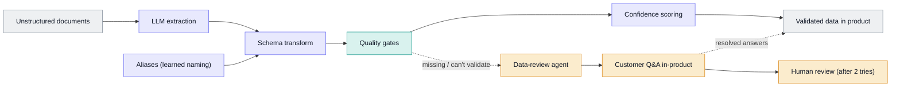

# Unstructured Data Pipeline

An event-driven pipeline that turns messy farm documents into clean, validated data.

Built at BX. What's shown here is the architecture and the design decisions.

A senior engineer led the initial pipeline architecture. I designed the data models it runs on, evolved the pipeline, and now own and operate it in production. I also built the [data-review-agent](../data-review-agent), its human-in-the-loop layer, end to end.

## At a glance

| | |
|---|---|
| **What it is** | An event-driven pipeline that turns unstructured farm documents (PDFs, scans, spreadsheets, handwriting) into clean, schema-validated, decision-ready data. |
| **My role** | Designed the data models, built the data-review agent end to end, and own and operate the pipeline in production. |
| **Stack** | GCP (Cloud Functions, Pub/Sub, BigQuery, Postgres), Python, LLMs via an OpenRouter-style abstraction (one interface over many model providers). |
| **Outcome** | Manual data entry removed: a document goes from upload to a validated, stored record without anyone typing it in. |

**Supporting files**

- [`example-record.json`](./example-record.json): synthetic validated record.

## The problem

Agriculture is one of the messiest data industries. Customers send whatever they have: supplier invoices, lab reports, spreadsheets, scanned notebooks, sometimes handwriting. Before this pipeline, turning that into usable data was manual, done by our team or the customer, and it was the bottleneck to onboarding and everything downstream.

Every analysis, carbon footprint report and product metric is only as good as this input. Bad data here quietly becomes wrong insight and lost trust later.

## What it does

A supplier fuel invoice arrives as a PDF.

1. The LLM reads it and extracts the fields, whatever the invoice's layout.
2. The fields are mapped onto a canonical (standard) schema for that entity type. An **aliases** layer translates this customer's wording (e.g. "Red Diesel (gas oil)") to the canonical value (`red_diesel`).
3. Deterministic quality gates check the record: are required fields present, are types right, are enum values valid? If not, it is held, not loaded.
4. The transform is scored for confidence: a deterministic completeness score plus an LLM-as-judge score (a second LLM call that grades the output). A low score triggers a retry with feedback before anything else happens.
5. If data is genuinely missing from the document, the data-review agent asks the customer in-product and, after repeated non-resolution, escalates to a human.
6. The validated record lands in the product, carrying its provenance (where it came from) and audit trail.

## Architecture

The colours carry the central decision: what is **automated**, what stays a **deterministic rule**, and where a **human** stays in the loop.

- **Automated (LLM):** extraction, schema mapping, the aliases layer, the LLM-as-judge score.
- **Deterministic (rules):** the quality gates and deduplication.
- **Human in the loop:** the data-review agent's customer Q&A and the escalation to a person.

## Data model

Each supported entity type (fuel, feed, yield and so on) has a canonical schema. Two choices do most of the work:

- **A canonical schema per entity type**, so everything downstream reads one predictable shape, whatever the source document.
- **An aliases layer** that learns each customer's naming and maps it to canonical values. Farm naming is inconsistent even within one customer, so a global dictionary was never going to hold. Aliases make the system improve per customer over time.

## Rules & logic

- **Quality gates (deterministic, fail-closed):** completeness against required fields (row- and batch-level thresholds), type checks, and enum validation against known-valid values. A batch that fails is held and surfaced, never loaded.
- **Confidence (two signals):** a deterministic completeness score, plus an LLM-as-judge score on the transformation. Low confidence triggers a bounded retry-with-feedback loop before escalation.
- **Deduplication:** exact match first, then a business-key match that keeps the most complete record.
- **Human in the loop:** when a required value isn't in the source, the agent asks the customer in-product. After repeated non-resolution, it escalates to a person.

## Key decisions

The heart of the system is deciding, for each step, whether to automate it, keep it a deterministic rule, or keep a human in it.

| Decision | Why | Rejected alternative |
|---|---|---|
| **LLM for extraction** | Document formats vary endlessly; rules can't keep up | Per-format parsers or regex templates: don't scale, break on every new layout |
| **Deterministic quality gates** | Correctness checks must be predictable, auditable and fail-closed | Letting the LLM judge correctness: not auditable, not reproducible |
| **Human for genuine gaps** | You can't automate a fact that isn't in the document | Model imputation or defaults: wrong data is worse than missing data |
| **Per-customer aliases layer** | Farm naming is customer-specific and inconsistent | One global dictionary: can't represent the variation |
| **Two confidence signals** | The deterministic score catches structural gaps; the LLM judge catches semantic ones | A single score: blind to one failure class or the other |

## Failure modes & lessons

- **Ambiguity at the source** (handwriting, one word read as another) was the first hard problem. The aliases layer plus human confirmation contains it.
- **Missing-source data is an information problem, not a model problem.** Cleverer prompts were the wrong instinct; routing it to the customer was the right one.
- **Model drift:** LLMs move fast, and a pipeline built around one is a few generations behind within a year. Lesson: invest earlier in a model-agnostic seam and an eval harness, so a new model can be benchmarked and swapped quickly.
- **Evals ran manually, not in CI.** The biggest thing I'd change: make the golden-dataset evals (a fixed set of documents with known-correct outputs) and tests an automatic gate on every change.

## Rebuild spec

1. A canonical schema per entity type, plus a per-customer aliases store.
2. An extraction stage (LLM) that reads any document into that schema.
3. A deterministic validation stage (completeness, type, enum), fail-closed.
4. A confidence stage: deterministic score + LLM-as-judge, with a bounded retry-with-feedback loop.
5. A human-in-the-loop review path for data that genuinely isn't in the source.
6. Provenance on every record (source document, what was extracted, confidence, aliases applied).
7. From day one: a golden-dataset eval harness wired into CI, and a model-agnostic seam so models can be swapped and re-benchmarked.
